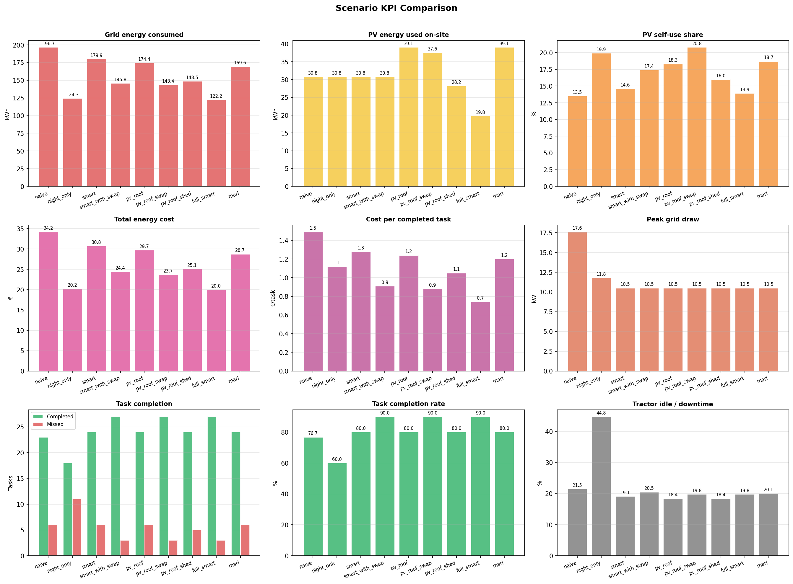
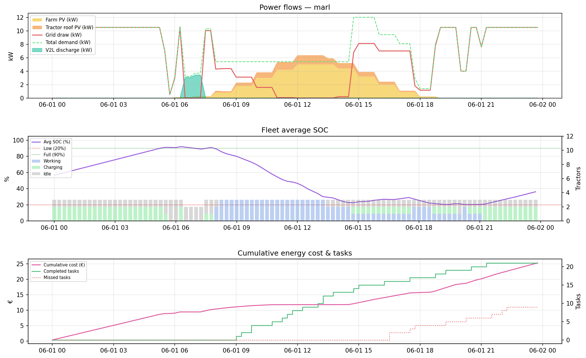
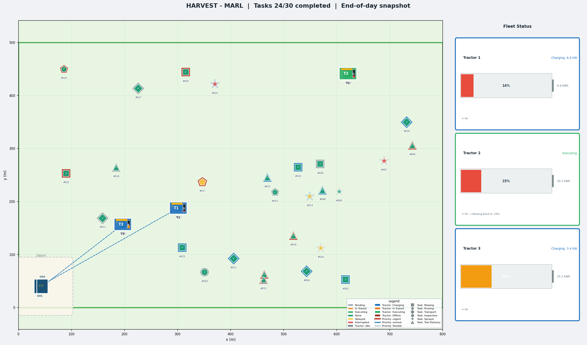
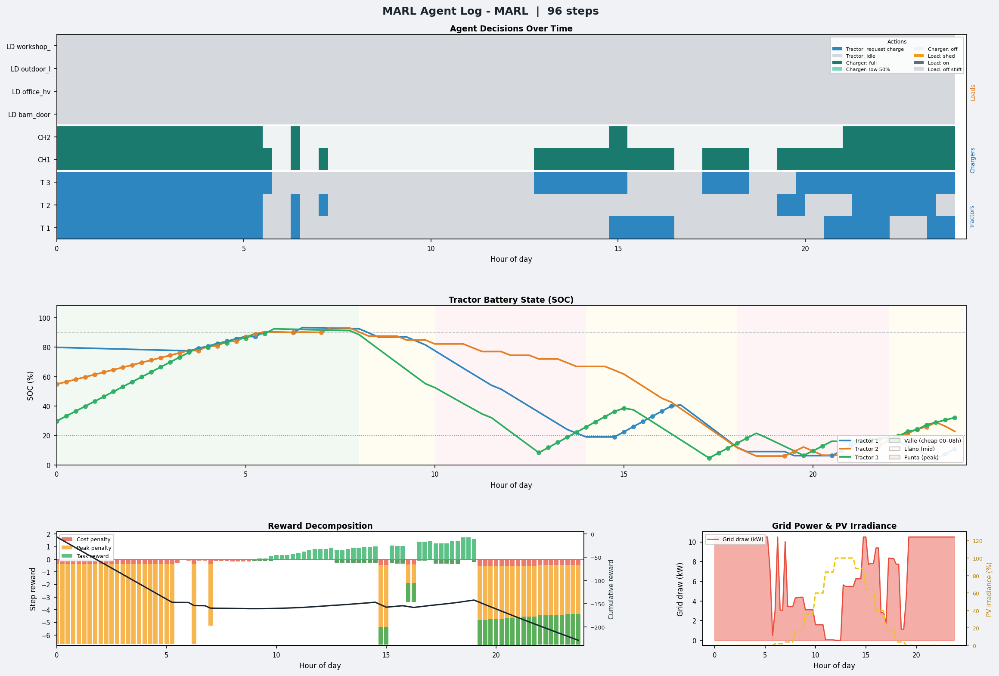
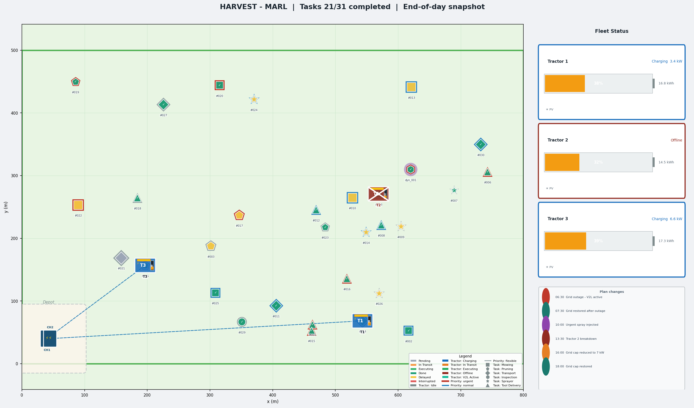
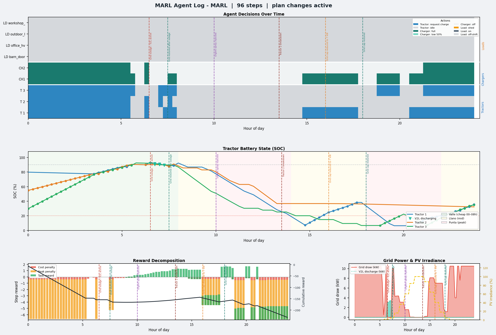

# HARVEST

**Hybrid Agricultural Renewable Via Energy Storage**  
Cloud–Edge–IoT orchestration framework for energy-aware agricultural systems — intelligent coordination of electric tractors, PV generation, batteries and smart farm infrastructure.

> O-CEI 1st Open Call · Challenge P6C1 · High Performance Creators (HPC Bulgaria)

---

## What is HARVEST?

HARVEST is a CEI energy orchestration system for smart agriculture. It enables coordinated management of electric tractor fleets (ZETRABOT), renewable energy (PV), battery storage, and distributed farm IoT loads through a unified, vendor-agnostic platform.

The current repository contains the **pilot6 simulation engine** — a Python-based discrete-time simulator used to develop, validate and demonstrate charging strategies and energy management logic ahead of real hardware integration.

---

## Repository Structure

```
harvest/
├── main.py                   # Core simulation engine — scheduler, PV model, KPI computation
├── task_generator.py         # Realistic farm task generation (priority waves, PTO, deadlines)
├── config.yaml               # All simulation parameters — fleet, PV, consumers, scenarios
├── server.py                 # Local HTTP server bridging dashboard <-> simulation
├── dashboard.html            # Self-contained web UI (zero external dependencies)
├── requirements.txt          # Python dependencies
├── config.local.yaml         # Local overrides — gitignored, never committed (optional)
├── generate_prediction_overview.py  # Regenerates images/prediction_overview.png
├── predictor/                # Prediction module (TPI3)
│   ├── __init__.py           #   build_predictors() factory + public API
│   ├── base.py               #   Abstract base classes (BasePVPredictor, BaseLoadPredictor)
│   ├── static.py             #   Static profile wrapper — backward-compatible default
│   ├── synthetic.py          #   Synthetic training data generator
│   ├── nn_predictor.py       #   Neural network train + inference (Keras/TensorFlow)
│   └── weather.py            #   Open-Meteo live weather + offline seasonal stub
├── marl/                     # Multi-agent RL engine (T3.4)
│   ├── __init__.py           #   build_marl_engine() factory
│   ├── base.py               #   BaseAgent + observation dataclasses
│   ├── agents.py             #   TractorAgent, ChargingStationAgent, LoadAgent
│   └── environment.py        #   MARLEnvironment — replaces Scheduler.allocate_charging()
├── harvest_control/          # Fleet control interface (TPI2 / T3.2 bridge)
│   ├── __init__.py           #   Public re-exports
│   ├── interface.py          #   FleetInterface contract + state/command dataclasses
│   ├── sim_backend.py        #   SimulationFleetInterface + Adapters hook for pilot6
│   ├── demo_autonomous_control.py  # Runnable TPI2 demo — writes execution_log.csv
│   └── ros2_bridge.py        #   Skeleton ROS 2 node (Stage 3, guarded imports)
├── farmview/                 # Visualisation package
│   ├── __init__.py
│   ├── _colors.py
│   ├── _renderer.py          #   render_farm() — top-down farm map
│   ├── _marl.py              #   render_marl_log() — MARL agent dashboard
│   └── __main__.py           #   python -m farmview CLI
├── roi/                      # ROI & Investment analysis (long-term economics)
│   ├── __init__.py           #   run_roi_analysis() public API
│   ├── models.py             #   Typed assumptions / totals / cash-flow / result structures
│   ├── calculator.py         #   NPV, IRR, simple & discounted payback, ROI, escalation
│   ├── period_runner.py      #   Aggregates the simulator over exact/representative periods
│   ├── investments.py        #   Electric-vs-diesel, farm PV, roof PV, chargers, portfolio
│   ├── reliability.py        #   Outage expected-value model + avoided outage cost
│   ├── engine.py             #   Orchestrator: variants → investments → sensitivity
│   ├── validation.py         #   Central input validation + advisory warnings
│   ├── export.py             #   roi_summary.csv / roi_cashflows.csv / *.json writers
│   └── __main__.py           #   python -m roi CLI
└── tests/                    # Unit + integration tests (stdlib unittest)
    ├── test_calculator.py    #   NPV / IRR / payback / ROI primitives
    ├── test_investments.py   #   Diesel litres, PV paired-sim, degradation, double-count
    ├── test_reliability.py   #   Islanding rule, expected-value outage cost
    ├── test_period_runner.py #   Period resolution, seasonality, determinism
    └── test_integration.py   #   Existing sim preserved + ROI engine end-to-end
```

---

## Quick Start

### Install dependencies

```bash
pip install -r requirements.txt
```

### Option A — Command Line

```bash
python main.py
```

Results are saved to `./outputs/`:
- `scenario_summary.csv` — KPIs for all scenarios
- `timeseries_<scenario>.csv` — 15-min power/SOC timeseries
- `task_schedule_<scenario>.csv` — per-task lifecycle log
- `*.png` — KPI comparison charts and per-scenario power profiles

The power flow of the `full_smart` scenario:

[](./images/full_smart_detail.png)

Scenario KPI comparison:

[](./images/kpi_comparison.png)

### Option B — Web Dashboard (recommended for demos)

```bash
python server.py
```

Then open **http://localhost:8765** in Firefox, Chrome, or Edge.
The browser opens automatically. The dashboard is fully self-contained — Chart.js is bundled inline, no internet connection required.
Use the header tabs to switch between the **Operations** view and the **ROI & Investment** view.

[](./images/dashboard-overview.png)

### Option C — ROI & Investment analysis (CLI)

```bash
python -m roi --config config.yaml --start 2026-01-01 --end 2026-12-31 --period-mode auto --horizon 10
```

Writes `outputs/roi/roi_summary.csv`, `roi_cashflows.csv`, `roi_assumptions.json` and
`roi_report.json`. See **ROI & Investment Analysis** below for the full model.

---

## Dashboard Usage

1. **Left panel** — adjust parameters with sliders:
   - *Grid & PV*: grid cap (kW), farm PV array size, tractor roof panel wattage
   - *Fleet*: number of tractors, chargers, charger power, battery capacity
   - *Tasks*: task count (5–60), RNG seed

2. **Scenarios** — click pills to include/exclude. Tags show active features:
   - `PV` — tractor roof panels enabled
   - `shed` — non-critical loads suppressed during grid stress

3. **RUN SIMULATION** — calls `server.py`, which runs the real Python simulator and returns results within seconds.

4. **Results panel**:
   - 5 KPI summary cards (lowest cost, best PV self-use, tasks completed, peak grid, grid efficiency)
   - Scenario comparison table with inline progress bars
   - Energy cost and task completion charts
   - **Task status table** — collapsible per-scenario view with phase badges, progress %, tractor assignment, delay reason

[](./images/task-status.png)

---

## Prediction Module

The `predictor/` package satisfies **TPI3** (AI prediction module, target ≤25% MAPE) and provides the foundation for future MARL-based pro-active scheduling.

[](./images/prediction_overview.png)

> **Regenerate this image** after changing `config.yaml` (e.g. PV peak, consumers, tariffs):
> ```bash
> python generate_prediction_overview.py
> ```
> Output: `images/prediction_overview.png`

The four panels above show:

- **Top-left — PV Generation (Seasonal Variation)**: PV output varies 5× between winter (Jan ≈1 kW peak) and summer (Jun 5 kW peak). The `WeatherStub` backend models this with a seasonal cosine factor. The static config profile (dashed) is used by default.
- **Top-right — Farm Load Profile**: All 9 consumers stacked by schedule. Total load ranges from 0.5 kW overnight (fence only) to 9.7 kW at the morning irrigation + workshop peak.
- **Bottom-left — Predictor Backends**: Four faint lines show stochastic synthetic training samples (with noise). The static profile and seasonal stub are compared — the NN backend learns the bell-curve shape from these samples.
- **Bottom-right — ForecastBundle Charging Headroom**: `grid_cap + PV_forecast − load_forecast` computed for each hour. The best 2-hour charging window (12:00 in June) is highlighted. Tariff bands show cost context: valle (cheap, 00–08h), llano (medium), punta (expensive, 10–14h and 18–22h).

### Local configuration overrides

To change the backend (or any other setting) without modifying `config.yaml`, create a `config.local.yaml` file in the same folder. It is **gitignored** and deep-merged on top of `config.yaml` at every startup — no git commits needed.

```yaml
# config.local.yaml  (gitignored — safe to edit freely)
prediction:
  pv:
    backend: nn
    model_path: models/harvest_nn_hu50_ep2000_dropNone.keras
```

A ready-to-use template with all common examples is provided in `config.local.yaml.example`. Copy and rename it:

```bash
# Windows
copy config.local.yaml.example config.local.yaml

# macOS / Linux
cp config.local.yaml.example config.local.yaml
```

Delete or rename the file to revert to `config.yaml` defaults instantly.

### Backends

Select the backend in `config.local.yaml` (preferred) or `config.yaml`:

```yaml
# config.local.yaml — pick one backend:
prediction:
  pv:
    backend: static      # default — uses the static hourly profile from config
    # backend: stub      # seasonal bell curve, no dependencies, fully offline
    # backend: openmeteo # live weather forecast (free, no API key, needs internet)
    # backend: nn        # trained neural network (see training steps below)
    # model_path: models/harvest_nn_hu50_ep2000_dropNone.keras
```

| Backend | When to use | Internet | TensorFlow |
|---|---|---|---|
| `static` | Simulation, demos | No | No |
| `stub` | Offline seasonal estimate | No | No |
| `openmeteo` | Live pilot deployment | Yes | No |
| `nn` | TPI3 validation, MARL training features | No | Yes |

### Training the neural network (TPI3)

The architecture directly mirrors the paper *"Using Neural Network for Predicting the Load of Conveyor Systems"* (Tsvetanov et al.) - a single hidden-layer FFNN with ReLU activations, Xavier initialisation, and Adamax optimiser. The key additions for HARVEST are a third input feature (`month`) to capture seasonal PV variation, and two outputs: `pv_shape` (normalised 0–1 irradiance) and `farm_load_kw`.

```bash
# 1. Generate training and test datasets from synthetic data
python -m predictor.synthetic --weeks 12 --seed 42 --output train.npz
python -m predictor.synthetic --weeks 5  --seed 99 --output test.npz

# 2. Train (50 hidden units — best result in the paper)
pip install tensorflow
# bash / macOS / Linux:
python -m predictor.nn_predictor \
    --train  train.npz     \
    --test   test.npz      \
    --hidden 50            \
    --epochs 2000          \
    --out    models/

# PowerShell (Windows) — use backtick ` for line continuation:
python -m predictor.nn_predictor `
    --train  train.npz `
    --test   test.npz  `
    --hidden 50        `
    --epochs 2000      `
    --out    models/

# 3. Enable in config.yaml
#    prediction.pv.backend: nn
#    prediction.pv.model_path: models/harvest_nn_hu50_ep2000_dropNone.keras
```

The training script prints MAPE per output at the end. A 50-HU network on 12 weeks of synthetic data consistently meets the ≤25% MAPE target (TPI3). A `*_loss.csv` file is also written alongside the model for loss curve analysis.

### Using `ForecastBundle` for pro-active scheduling

```python
from predictor import build_predictors, ForecastBundle
import yaml
from datetime import date, datetime

cfg    = yaml.safe_load(open("config.yaml"))
pv, ld = build_predictors(cfg)
bundle = ForecastBundle(pv, ld, grid_max_kw=10.5)

# Available charging headroom at any future timestamp
headroom = bundle.net_available_kw(datetime(2026, 6, 1, 14))

# Best 2-hour charging window for the day (used by smart scheduler)
best_h = bundle.best_charging_window(date(2026, 6, 1), duration_hours=2)
print(f"Best charging window: {best_h}:00 – {best_h+2}:00")
```

The `ForecastBundle` is the bridge between the prediction module and the future MARL engine: each PPO agent will query it as a feature when deciding whether to charge now or wait for a better window.

---

## MARL Engine

The `marl/` package implements **T3.4** — a multi-agent reinforcement learning engine that replaces the centralised `Scheduler.allocate_charging()` with per-agent decisions. It is activated by the `marl` scenario or by setting `marl.enabled: true` in `config.yaml`. The simulator falls back to the rule-based scheduler transparently on any error.

### Agents

| Agent | Count | Observation space | Action space |
|---|---|---|---|
| `TractorAgent` | one per tractor | SOC, is_charging, has_task, task_urgency, deadline, tariff, net_power, pv_shape, hour | idle / request_charge |
| `ChargingStationAgent` | one per charger | is_occupied, connected_soc, net_power, tariff, pv_shape, hour | off / low (50%) / full |
| `LoadAgent` | one per deferrable consumer | priority, power_kw, net_power, tariff, hour | on / off |

All agents are currently **rule-based**. The architecture is designed so that a learned PPO policy can be dropped in by overriding `act()` on any agent class — `learn()` and `compute_step_rewards()` are already wired into every simulation step to provide the data pipeline.

### Reward

`MARLEnvironment.compute_step_rewards()` returns a scalar per agent at each 15-min step:

```
team_reward = −cost_eur × w_cost  −  grid_excess_kw × w_peak  +  tasks_done × 0.01 × w_task
tractor_reward = team_reward − |soc − 0.6| × w_battery × 0.05
```

Weights are set in `config.yaml` under `marl.reward_weights`.

### Configuration

```yaml
marl:
  enabled: true
  algorithm: rule_based     # rule_based | ppo (planned)
  agents:
    tractors:
      enabled: true
      charge_threshold_soc: 90
    charging_stations:
      enabled: true
    loads:
      enabled: true
      managed_priorities: [low, normal]   # critical/high are never shed
  reward_weights:
    energy_cost: 1.0
    peak_power: 3.0
    task_completion: 10.0
    battery_stress: 1.0
```

### MARL Visualisations

Running `python main.py` (or `python -m farmview marl`) produces three output files for the `marl` scenario.

**Power profile** (`marl_detail.png`) — grid draw, PV generation, and charging events across the day, generated by the MARL engine alongside the standard scenario comparison charts:

[](./images/marl_detail.png)

**Farm map** (`marl_farm_map.png`) — top-down view of the 800 × 500 m farm at end-of-day. Shows tractor positions and statuses (charging, executing, idle), charger occupancy, task markers by type (spray, harvest, transport, …), and a fleet panel with task completion summary:

[](./images/marl_farm_map.png)

**MARL agent dashboard** (`marl_marl_dashboard.png`) — four panels driven by per-step agent logs:

- **SOC traces** — battery state-of-charge for each tractor through the day
- **Agent heatmap** — per-step action of every tractor, charger, and load agent (colour-coded by decision state)
- **Reward decomposition** — per-step team reward broken down by cost, peak, and task components
- **Grid power** — grid draw vs cap with tariff bands overlaid

[](./images/marl_marl_dashboard.png)

### Dynamic Plan-Change Events

Setting `dynamic_events_enabled: true` in `config.yaml` injects four mid-day disruptions into the simulation, exercising the system's ability to re-plan autonomously without human intervention:

```yaml
dynamic_events_enabled: true

dynamic_events:
  - at: '2026-06-01 10:00:00'
    type: task_inject
    label: 'Urgent spray injected'
    task: {name: 'Emergency sprayer B', priority: urgent, duration_minutes: 35, uses_pto: true}
  - at: '2026-06-01 13:30:00'
    type: tractor_offline
    label: 'Tractor 2 breakdown'
    tractor_id: tractor_2
  - at: '2026-06-01 16:00:00'
    type: grid_reduce
    label: 'Grid cap reduced to 7 kW'
    new_max_kw: 7.0
  - at: '2026-06-01 18:00:00'
    type: grid_restore
    label: 'Grid cap restored'
```

Event markers (coloured dashed verticals) appear on all dashboard panels and in the fleet log on the farm map. Dynamically injected tasks are highlighted with a purple halo. The dashboard title appends `| plan changes active` when events are enabled.

**Farm map with dynamic events** — the fleet panel on the right lists each fired event with its timestamp. The purple-haloed task marker shows the urgently injected spray run:

[](./images/marl_farm_map_dynamic_events.png)

**MARL dashboard with dynamic events** — vertical markers on all four panels show exactly when each disruption occurred, making it easy to read the system's response (Grid outage and restore, SOC dip after breakdown, grid draw drop after cap reduction, load restoration after cap restore):

[](./images/marl_marl_dashboard_dynamic_events.png)

---

## Fleet Control Interface

The `harvest_control/` package provides the **transport-agnostic boundary** between the decision layer (scheduler / MARL agents) and the plant — the pilot6 simulation today, the real ZETRABOT tractors in Stage 3.

```
decision layer  -->  FleetInterface  -->  { SimulationFleetInterface  (now)
                                         { Ros2FleetInterface          (Stage 3)
```

The decision layer only ever calls three methods, so the control logic validated here carries over to the September field deployment **without modification**:

| Method | Direction | Description |
|---|---|---|
| `snapshot()` | plant → decision | Returns `FleetSnapshot`: grid state, all tractor/charger/load states |
| `submit(cmds)` | decision → plant | Issues a batch of `Command` objects; returns one `CommandAck` per command |
| `advance(minutes)` | — | Steps a simulation backend forward (no-op on real hardware) |

### Command types

| Command | Effect |
|---|---|
| `Command.request_charge(tractor_id)` | Dock a tractor and start drawing power |
| `Command.release_charge(tractor_id)` | Stop charging / undock |
| `Command.set_charger_level(charger_id, level)` | `OFF` / `HALF` (~50 % rated) / `FULL` |
| `Command.assign_task(tractor_id, task_id)` | Begin a new farm task |
| `Command.preempt_task(tractor_id)` | Interrupt the current task |
| `Command.shed_load(load_id)` | Suppress a deferrable consumer |
| `Command.restore_load(load_id)` | Re-enable a previously shed consumer |

### TPI2 demo — 100 % autonomous control

```bash
# from the repo root
python -m harvest_control.demo_autonomous_control            # nominal day
python -m harvest_control.demo_autonomous_control --events   # with 4 mid-day plan changes
```

The demo drives a full simulated day with a tariff/PV/headroom-aware policy — no human in the loop. Output:

```
decisions executed              : 31
without manual intervention     : 100.0 %   (TPI2 target >= 70 %)
peak grid draw                  : 10.53 kW (cap 10.5 kW)
final state of charge           : {'T1': 85.5, 'T2': 88.1, 'T3': 85.7}
execution log written           : execution_log.csv
```

With `--events`, all four mid-day disruptions (urgent task injection, tractor breakdown, grid cap reduction, grid cap restore) are handled autonomously:

```
dynamic events handled          :
   - 10:00 emergency task injected
   - 13:30 Tractor 2 breakdown
   - 16:00 grid cap -> 7 kW
   - 18:00 grid cap restored
```

`execution_log.csv` (written to the current directory) is the TPI2 evidence file: one row per actuation command, with `manual_intervention: false` on every row.

### Wiring to the pilot6 engine

`SimulationFleetInterface` uses a compact built-in reference sim when constructed with no arguments. To wrap the real pilot6 engine instead, pass it and a set of `Adapters` callables:

```python
from harvest_control import SimulationFleetInterface, Adapters, TractorState, GridState

iface = SimulationFleetInterface(env=my_pilot6_env, adapters=Adapters(
    read_tractors = lambda env: [TractorState(t.id, t.soc_pct, t.kwh, t.online,
                                               t.charging, t.task) for t in env.tractors],
    read_chargers = lambda env: [...],
    read_loads    = lambda env: [...],
    read_grid     = lambda env: GridState(env.clock, env.grid_kw, env.cap,
                                          env.pv, env.tariff, env.price),
    apply_command = lambda env, c: env.handle(c),
    step          = lambda env, mins: env.step(mins),
))
```

### ROS 2 bridge (Stage 3)

`ros2_bridge.py` is a skeleton `rclpy` node that publishes `FleetSnapshot` messages and turns incoming ROS 2 commands into `FleetInterface.submit()` calls. The module imports cleanly with no ROS installation — it degrades to offline/parse-only mode and the simulation demo is unaffected. For the September deployment the backend is swapped for a `Ros2FleetInterface` that subscribes to the real ZETRABOT topics. The only remaining input needed to finalise the message definitions is confirmation of the ZETRABOT signal set.

Proposed topic map:

| Topic / Service | Direction | Type |
|---|---|---|
| `/harvest/fleet/snapshot` | publish | `harvest_msgs/FleetSnapshot` |
| `/harvest/command` | service | `harvest_msgs/SubmitCommand` |
| `/harvest/tractor/{id}/state` | publish | `harvest_msgs/TractorState` |
| `/harvest/tractor/{id}/cmd` | subscribe | `harvest_msgs/Command` |

---

## Simulation Model

### Scenarios

| Scenario | Charging strategy | Tractor PV | Load shedding | MARL |
|---|---|---|---|---|
| naive | Immediate full power | ✗ | ✗ | ✗ |
| night_only | Valle tariff hours only (00–08h) | ✗ | ✗ | ✗ |
| smart | PV surplus + grid headroom | ✗ | ✗ | ✗ |
| smart_with_swap | Smart + battery module swaps | ✗ | ✗ | ✗ |
| pv_roof | Smart + tractor roof panels | ✓ | ✗ | ✗ |
| pv_roof_swap | Smart+swap + roof panels | ✓ | ✗ | ✗ |
| pv_roof_shed | Smart + roof + load shedding | ✓ | ✓ | ✗ |
| full_smart | All optimisations active | ✓ | ✓ | ✗ |
| marl | Per-agent decisions (MARL engine) | ✓ | ✓ | ✓ |

### Farm Consumers Modelled

| Load | kW | Priority | Schedule |
|---|---|---|---|
| Electric fence | 0.2 | critical | always |
| Irrigation pump ×2 | 3.0 | high | 06–08h / 19–21h |
| Barn door motors | 0.5 | normal | 07–08h |
| Cold storage | 1.2 | high | 08–20h |
| Workshop tools | 2.5 | normal | 08–17h |
| Office HVAC | 1.5 | low | 08–18h |
| Outdoor lighting | 0.8 | normal | 20–23h |
| Security lighting | 0.3 | critical | 22–06h |

### Task Lifecycle

Tasks follow a two-phase model:

```
PENDING → TRANSIT → EXECUTING → DONE
              |
         INTERRUPTED (preempted by urgent task, re-queued)
PENDING → DELAYED   (window expired, extended deadline, re-queued)
```

- **TRANSIT**: tractor drives to task location at eco speed (10 km/h). Interruptible by higher-priority urgent tasks.
- **EXECUTING**: PTO engaged, active work. Not interruptible.
- **DELAYED**: original window expired but task remains in queue with a +6h extended deadline.

### Key KPIs

| KPI | Description |
|---|---|
| `total_cost_eur` | Total grid energy cost for the day |
| `pv_self_use_share_pct` | PV used ÷ total demand (note: can be inflated by low demand) |
| `pv_utilisation_pct` | PV used ÷ PV generated (demand-independent solar integration metric) |
| `grid_kwh_per_completed_task` | Normalised energy efficiency per task completed |
| `task_completion_pct` | % of tasks reaching DONE status |
| `tractor_downtime_pct` | % of fleet time spent idle (not working or charging) |
| `peak_grid_kw` | Maximum instantaneous grid draw |
| `cost_per_completed_task_eur` | Total cost divided by tasks completed |

> **Night only** appears cheap because it charges at valle tariff (0.15 €/kWh) but tractors run out of battery by afternoon and complete only ~85% of tasks. Use `grid_kwh_per_completed_task` to compare true efficiency across scenarios.

---

## ROI & Investment Analysis

The `roi/` package adds a dedicated **long-term return-on-investment** layer on top
of the one-day operational simulator. Where the Operations view compares operational
scenarios for a single simulated day, the **ROI & Investment** view answers a
different question: *over a 5–20 year horizon, do the main HARVEST investments pay
back?* It is available as a dashboard tab, an HTTP endpoint (`POST /api/roi`) and a
headless CLI (`python -m roi`).

> **All ROI outputs are estimates based on user-supplied assumptions.** The financial
> figures shipped in `config.yaml` are **demonstration assumptions** — illustrative
> examples, **not** commercial quotations or verified market prices. Replace them with
> supplier quotations and local operating data before making an investment decision.

### Connected Operations → ROI workflow

ROI is **not a separate simulator**. It is based strictly on the latest successful
Operations run:

```
Configure Operations  →  Run Operations  →  Open ROI  →  Select period & financial
assumptions  →  Run long-term ROI analysis
```

- The ROI **Run** button is disabled until Operations has been run successfully. Until
  then the ROI page shows: *"Run the Operations simulation first. ROI uses the fleet,
  energy system, tasks, seed, and scenarios from the latest successful Operations run."*
- A successful `/simulate` returns an **`operations_run_id`**; the server keeps that
  run's normalised request + merged config in memory. The `/api/roi` request must carry
  the identifier, and the endpoint rejects a missing / unknown / expired / mismatched id
  with **HTTP 409** and the message *"Run the Operations simulation before running ROI
  analysis."* Operational parameters are always taken from the saved run, never from
  independently editable ROI fields.
- **All scenarios** selected in Operations are propagated automatically and shown
  read-only under *"Scenarios from Operations"*. ROI cannot introduce a scenario that
  was not selected on the Operations page.
- Operational controls (fleet, PV, chargers, tasks, seed, tariffs, scenarios,
  prediction backend, MARL/shedding/dynamic-event config…) come from Operations and are
  displayed read-only in an **Operational basis** card with a *Return to Operations*
  button. They are never duplicated as editable ROI inputs.
- Changing **any** Operations input or scenario selection marks the result **stale**,
  invalidates the ROI source and disables ROI: *"Operations settings have changed. Run
  the Operations simulation again before calculating ROI."*
- The ROI page produces **two separate result types**: a **long-term operational
  comparison** (how every scenario performs over the period) and the **investment
  analysis** (financial return from paired/counterfactual simulations). They are shown
  in distinct sections and never merged into one unexplained result.

### Operational period vs financial horizon

Two independent time concepts, kept deliberately separate in the UI:

| Concept | Meaning | Example |
|---|---|---|
| **Operational data period** | The calendar range actually simulated to measure annual energy, fuel, distance and hours | 2026-01-01 → 2026-12-31 |
| **Financial investment horizon** | The number of years the cash-flow model projects (payback, NPV, IRR) | 10 years |

The operational period is simulated once and **annualised to a 365-day year**; the
annual totals then drive every year of the financial horizon (with escalation,
degradation and scheduled replacements applied per year).

### Period calculation modes

| Mode | Behaviour |
|---|---|
| `exact` | One deterministic simulation per calendar day in the range |
| `representative_month` | N representative days per covered month (default 1), weighted by calendar days — captures seasonal PV variation without simulating all 365 days |
| `auto` | `exact` for periods ≤ `auto_exact_max_days` (default 90), otherwise `representative_month` |

A deterministic seed rule keeps runs reproducible: **`daily_seed = base_seed + YYYYMMDD`**.

Because the default `static` PV backend has no seasonal variation, the period runner
applies a documented **monthly seasonal factor** (peak in June ≈ 1.0, trough in
December ≈ 0.25) to PV *generation* only when that backend is active — so a one-year
analysis reflects real seasonal PV differences instead of repeating the June day
unchanged. Installed capacity (and therefore CAPEX) is unaffected. When a genuinely
seasonal predictor (`stub` / `openmeteo` / `nn`) is active the factor is 1.0 to avoid
double-counting. The result metadata reports which method, how many simulations ran,
how many calendar days are represented, and the seasonal model used.

### Supported investments

| Investment | Baseline it is compared against |
|---|---|
| **Electric fleet vs diesel** | Same workload performed by an equivalent diesel fleet (matched-service) |
| **Fixed farm PV** | An identical simulation with `farm_fixed_peak_kw = 0` |
| **Tractor-roof PV** | An identical simulation with roof `panel_peak_w = 0` |
| **Charging infrastructure** | Included in the electric-fleet principal (CAPEX shown separately) |
| **Backup / islanding** | Grid-tied system with no backup (reliability benefit only) |
| **Combined HARVEST portfolio** | Sequential incremental stages — see below |

Each PV investment uses **paired simulations**: two otherwise-identical runs that
differ only in the asset under study, so savings come from the real simulator
behaviour, priced at **time-step tariffs** (never a single blended average price).

Every investment is computed **per source scenario** and labelled accordingly
(e.g. *"Fixed farm PV — Full smart"*, *"Electric fleet — Smart"*), so ROI is never
silently based on a single hard-coded scenario. Roof PV is only computed for scenarios
that actually include roof panels. Installed farm-PV kWp, roof-panel W and the equipped
tractor count all come from the Operations run — the ROI page supplies only unit costs.
Missing required inputs (e.g. a cleared CAPEX field) yield **"Input required"** rather
than a misleading zero-year payback, and such incomplete investments are excluded from
the portfolio.

### Electric-vs-diesel calculation

A diesel counterfactual performs exactly the electric fleet's workload:

```
travel_litres = travel_distance_km × litres_per_100km / 100
work_litres   = PTO_work_hours     × pto_litres_per_hour
idle_litres   = idle_hours         × idle_litres_per_hour
diesel_fuel_cost = (travel + work + idle) litres × diesel_price_per_litre
```

The electric alternative uses the **actual charging electricity cost from the
simulation** (charger input energy priced at time-step tariffs — not estimated from
total farm energy), plus charger CAPEX/install, electric maintenance and an optional
battery replacement. The comparison is **matched-service** (same generated task set,
compared on cost per completed task); a warning is raised if service levels differ.

### Farm PV & roof PV calculation

```
avoided_grid_cost = baseline_grid_cost − candidate_grid_cost   (paired sims, time-step priced)
```

Farm PV and roof PV are evaluated **independently** with separate ROI results.
Exported energy has zero value unless `export_surplus_enabled` is set (then it uses the
configured feed-in tariff — never net metering unless explicitly configured); PV
yield **degrades** each year while the value of each kWh **escalates** with the
electricity price. Farm PV and roof PV savings are never counted twice.

### Outage & reliability assumptions

Reliability is an **expected-value** model over the simulated 15-minute power
profile. For each step it compares critical demand against available backup supply:

```
expected_outage_hours_per_year = frequency_per_year × average_duration_hours
expected_unserved_energy       = Σ unsupported critical load over expected outages
expected_outage_cost           = unserved_energy × value_of_lost_load
                               + unsupported_hours × downtime_cost
                               + expected task-disruption cost
reliability_benefit            = baseline_outage_cost − candidate_outage_cost
```

> **Physical rule:** Grid-connected PV is assumed to disconnect during an outage and
> therefore provides **no** backup-power benefit unless an islanding-capable inverter
> is enabled. The simulator does **not** model a stationary backup battery, so its
> contribution is clearly labelled an **analytical** backup model (PV availability and
> critical load come from the simulated profile; the fixed battery and V2L headroom
> are analytical). Sources are never mixed silently.

### Combined portfolio — no double-counting

The portfolio uses a **sequential incremental** comparison so overlapping savings are
counted once:

1. Diesel fleet baseline
2. **+** Electric tractors & charging infrastructure (marginal vs diesel)
3. **+** Fixed farm PV (marginal vs stage 2)
4. **+** Tractor-roof PV (marginal vs stage 3)
5. **+** Islanding / backup (reliability benefit)

Each stage counts only its marginal benefit over the previous stage. The combined
portfolio benefit therefore does **not** equal the sum of the independently-calculated
standalone savings, and a warning states so explicitly.

### Financial formulas

`net_capex = equipment + installation + other − grants − subsidies`;
`annual_net_benefit = avoided_operating_cost + revenue + reliability_benefit −
maintenance − recurring_costs`. Year 0 holds the CAPEX. **NPV** discounts every year
plus residual value; **IRR** is found by numerically-safe bisection (returns *not
available* when cash flows don't admit a valid IRR); **simple** and **discounted
payback** interpolate the fractional year the cumulative cash flow turns non-negative;
**ROI** is `(cumulative_undiscounted_net_benefit − net_capex) / net_capex × 100`
(*N/A* when CAPEX ≤ 0). A cash-flow row is returned for every year with baseline /
candidate operating cost, fuel, electricity, maintenance, outage loss, revenue,
replacement, net, discount factor, discounted and cumulative values.

### ROI metrics

| Metric | Meaning |
|---|---|
| **Net CAPEX** | Equipment + installation − grants/subsidies |
| **Annual net benefit** | Operating savings + revenue + reliability − recurring costs (year 1) |
| **Simple ROI** | `(cumulative net benefit − CAPEX) / CAPEX × 100` over the horizon |
| **Simple payback** | First fractional year cumulative undiscounted cash flow ≥ 0 |
| **Discounted payback** | First fractional year cumulative discounted cash flow ≥ 0 |
| **NPV** | Discounted net present value incl. residual value |
| **IRR** | Internal rate of return (bisection; *N/A* if undefined) |
| **Expected outage cost** | Annual expected cost of unserved critical load + downtime |
| **Avoided outage cost** | Reliability benefit = baseline − candidate outage cost |

### Sensitivity analysis

A one-way sensitivity varies diesel price, electricity-price escalation, farm-PV CAPEX,
electric-tractor CAPEX, discount rate, outage frequency and value-of-lost-load by
±`variation_pct` (default 20%), recomputing portfolio NPV / payback / ROI for each.
It **reuses the operational energy totals** (no simulation re-runs) and is shown as a
tornado-style bar chart.

### Dashboard usage

Use the header tabs to switch between **Operations** and **ROI & Investment**. First
configure the farm on the Operations page and **RUN SIMULATION**. That successful run
becomes the source of truth for ROI. Then open the ROI tab:

1. An **Operational basis** card shows the run's read-only configuration (fleet, PV,
   chargers, battery, grid cap, tasks/day, seed, scenarios, one-day results) with a
   *Return to Operations* button. *Scenarios from Operations* are shown as read-only
   badges — there is no independent scenario selector.
2. Set the **analysis period**, period method and **financial horizon** (these are the
   only period controls ROI adds), and adjust the collapsible **financial / investment
   assumption** panels (each field shows its unit; per-tractor/per-charger amounts are
   labelled as such). *Reload from config* re-reads `config.yaml` + `config.local.yaml`;
   *Reset to demo* restores the shipped demonstration values.
3. **RUN ROI ANALYSIS** (disabled until Operations has run). Results show, in separate
   sections: the **long-term operational comparison** (every scenario over the period,
   with charts), the **investment analysis** (per source scenario, with *Input required*
   for cleared fields), the **combined portfolio** (with a scenario selector defaulting
   to the best one-day task completion), a **reliability** panel and a **sensitivity**
   chart. Warnings (demonstration note, distances derived, exact vs representative,
   outage analytical vs simulated, service-level differences, standalone-overlap) are
   always visible. Export **CSV / JSON** — both carry the `operations_run_id` and run
   metadata so a result can be traced back to its exact Operations run.

Changing any Operations control marks ROI **stale** and disables it until Operations is
re-run — the header shows `ROI unavailable` / `ROI stale` / `ROI ready` / `ROI running`
/ `ROI complete` / `ROI error`.

### CLI usage

The headless CLI evaluates every scenario in the config (or a subset via `--scenarios`);
it does not require the dashboard or a saved run:

```bash
python -m roi \
    --config config.yaml \
    --start 2026-01-01 \
    --end 2026-12-31 \
    --period-mode auto \
    --horizon 10 \
    --scenarios smart,full_smart      # optional; default = all config scenarios
```

Generated files (default `outputs/roi/`):

- `roi_summary.csv` — one row per investment (per scenario) plus each portfolio; carries `operations_run_id` + scenario
- `roi_cashflows.csv` — one row per investment per year
- `roi_assumptions.json` — resolved assumptions + `export_meta` (run traceability)
- `roi_report.json` — the full response (meta, operational basis, long-term, investments, portfolios, sensitivity)

### Configuration

The `roi:` section of `config.yaml` holds **demonstration assumptions** and documents
every field (`analysis`, `financial`, `service_value`, `electric_fleet`, `diesel`,
`farm_pv`, `tractor_roof_pv`, `outages`, `sensitivity`). Per-unit costs use explicit key
names (`electric_tractor_purchase_eur_each`, `charger_capex_eur_each`,
`residual_value_eur_each`, `grant_eur_total`, …). Economic assumptions are **never**
hard-coded in Python or JavaScript — the dashboard loads them from the server
(`GET /api/config`), and `config.local.yaml` can override any of them without a git
commit. **Operational** values (fleet, PV, chargers, tasks, seed, tariffs, scenarios)
are **not** in the `roi:` section — ROI always takes them from the Operations run.
`roi.demonstration_assumptions: true` makes the dashboard label the figures as demo.

### Warnings & limitations

- ROI is based strictly on the **latest successful Operations run**; it cannot run
  before Operations, and any Operations change invalidates a prior ROI result.
- ROI outputs are **estimates** based on user-supplied assumptions; the shipped
  demonstration prices are **not** commercial quotations.
- Missing required assumptions (e.g. a cleared CAPEX) show **"Input required"** — not a
  zero-year payback — and are excluded from the portfolio.
- Grid-tied PV provides **no** outage backup unless islanding is enabled.
- Standalone investment results **cannot always be added together** — use the portfolio.
- The stationary backup battery is an **analytical** model (not simulated); its results
  are labelled as such and never mixed with simulated values.
- Work (in-field) distances are **derived** from execution time × configured working
  speed; the dashboard states when distances are derived rather than measured.

### Future work — energy sharing (out of scope)

Energy exchange with neighbouring farms or households — peer-to-peer trading, energy
communities, export coordination — is **explicitly out of scope** for this module and
is noted here only as possible future work. Nothing in `roi/` implements it.

---

## Configuration

All parameters are in `config.yaml`. Key sections:

```yaml
simulation:
  start_time: "2026-06-01 00:00:00"
  end_time:   "2026-06-02 00:00:00"
  time_step_minutes: 15

grid:
  max_power_kw: 10.5

pv:
  farm_fixed_peak_kw: 5.0    # building/ground array peak capacity

tractor_pv:
  panel_peak_w: 650          # per-tractor roof panel

task_generation:
  mode: "generated"          # static | generated
  num_tasks: 20              # scale with fleet: ~6-7 tasks per tractor per day
  seed: 42
  work_speed_kmh: 4.0        # in-field working speed → derives task work-distance for ROI

prediction:
  pv:
    backend: static          # static | stub | openmeteo | nn

roi:                         # long-term ROI & investment economics — see the
  enabled: true              # "ROI & Investment Analysis" section above.
  # analysis / financial / diesel / electric_fleet / farm_pv / tractor_roof_pv /
  # outages / sensitivity …  (all economic values default to zero = "Input required")
```

---

## Project Status

### Stage 2 — Development of CEI Utilities

| TPI | Description | Target | Result | Status |
|---|---|---|---|---|
| TPI1 | Predictive scheduling module (local demo) | ≥ 10% peak / efficiency gain vs baseline | ≈ 40% peak reduction, ≈ 42% cost reduction | **ACHIEVED** |
| TPI2 | Autonomous decision execution | ≥ 70% decisions without manual intervention | 100% autonomous in all test scenarios | **ACHIEVED** |
| TPI3 | AI prediction module (energy demand) | ≤ 25% MAPE | Farm-load MAPE 22.98% | **ACHIEVED** |

### Stage 3 — Pilot Integration (target: 30 September 2026)

| TPI | Description | Target | Evidence |
|---|---|---|---|
| TPI4 | Pilot Integration | Fully operational pilot setup with ≥ 50% of system data exchanged using real data streams | System logs, data exchange records, interface monitoring outputs, validation report |
| TPI5 | Energy Optimisation | ≥ 10% reduction in energy consumption vs baseline under real pilot conditions | Energy measurements, before/after comparison, analysis report |
| TPI6 | O-CEI Marketplace Contribution | HARVEST components published (FIWARE data models, ROS2 interfaces, documentation/demo) | Uploaded assets, documentation, repository links |

**D2 Prototype deadline: 30 June 2026**

---

## Architecture (Target)

```
                    +-------------------------------------+
                    |         FIWARE NGSI-LD Broker        |  <- T3.1
                    |   Digital twins for all farm assets  |
                    +------------------+------------------+
                                       | NGSI-LD
          +----------------------------+--------------------+
          |                            |                    |
   +------+------+          +----------+--------+   +------+------+
   |  ROS2/FIROS2|          |  MARL Engine      |   |  BLE Mesh   |
   |  ZETRABOT   |          |  PPO agents       |   |  IoT sensors|
   |  interface  |          |  (edge, INT8)     |   |  (PV-powered|
   +------+------+          +----------+--------+   +-------------+
        T3.2                           | T3.4              T3.6
          |                   +--------+---------+
          |                   |  predictor/      |
          |                   |  PV + load       |
          |                   |  ForecastBundle  |
          |                   +--------+---------+
          |                            |
          +----------+   +------------+
                     |   |
              +------+---+-------+
              |  FleetInterface  |  <- harvest_control/ (THIS RELEASE)
              |  snapshot()      |     decision layer to plant boundary
              |  submit(cmds)    |     same API -> sim today, ZETRABOT Stage 3
              +--------+---------+
                       |
   +---------------------------------------+---------------------+
   |           pilot6 Simulation Engine (current)               |
   |   main.py  task_generator.py  config.yaml  dashboard.html  |
   +------------------------------------------------------------+
```

---

## Dependencies

```
Python >= 3.10
numpy, scipy, pyyaml, pandas, matplotlib   # core (always required)
tensorflow                                  # only for nn predictor backend
```

```bash
pip install -r requirements.txt
```

No cloud services or API keys required (except the optional `openmeteo` backend for live weather forecasts).

---

## Contact

**Simeon Tsvetanov** · set@hpc.bg  
High Performance Creators Ltd · Sofia, Bulgaria · [hpc.bg](https://hpc.bg)  
O-CEI Challenge P6C1 · Application ID: 691486e3b5fba953e852532f
