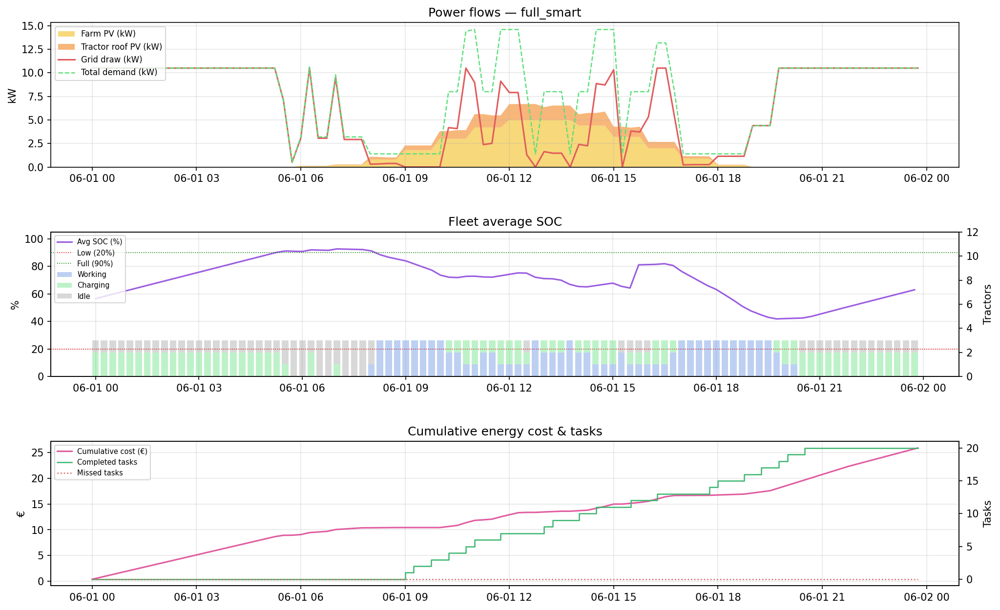
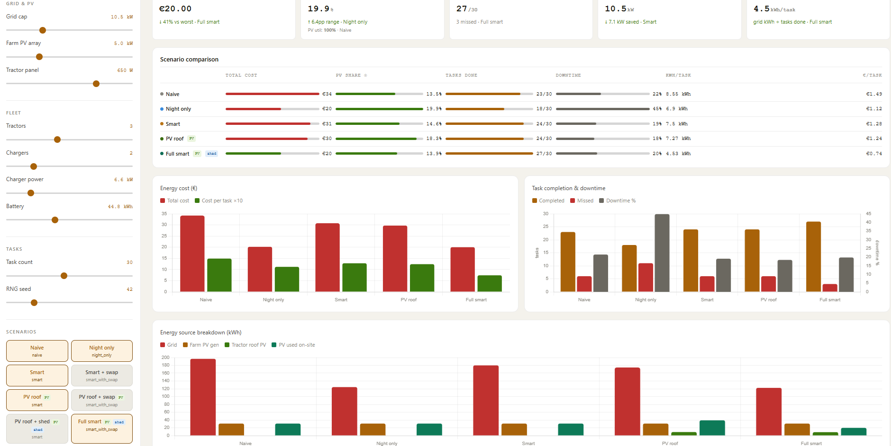
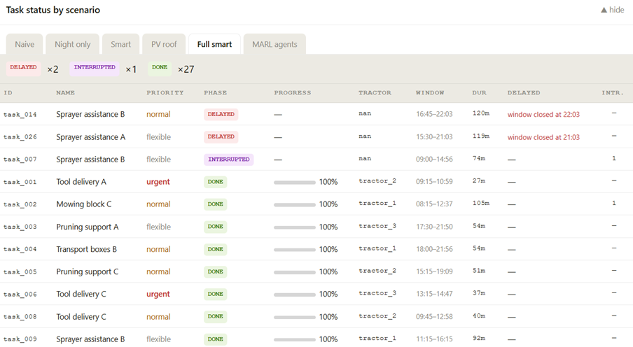
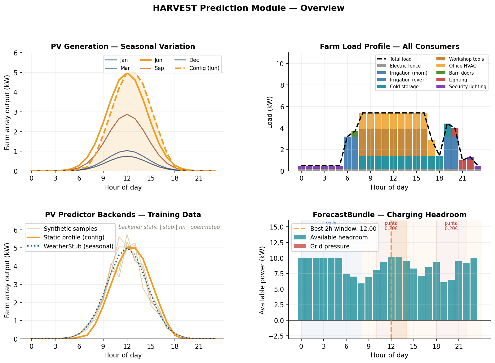

# HARVEST

**Hybrid Agricultural Renewable Via Energy Storage**  
Cloud–Edge–IoT orchestration framework for energy-aware agricultural systems — intelligent coordination of electric tractors, PV generation, batteries and smart farm infrastructure.

> O-CEI 1st Open Call · Challenge P6C1 · High Performance Creators (HPC Bulgaria)

---

## What is HARVEST?

HARVEST is a CEI energy orchestration system for smart agriculture. It enables coordinated management of electric tractor fleets (ZETRABOT), renewable energy (PV), battery storage, and distributed farm IoT loads through a unified, vendor-agnostic platform.

The current repository contains the **pilot6 simulation engine** — a Python-based discrete-time simulator used to develop, validate and demonstrate charging strategies and energy management logic ahead of real hardware integration.

---

## Repository Structure

```
harvest/
├── main.py                   # Core simulation engine — scheduler, PV model, KPI computation
├── task_generator.py         # Realistic farm task generation (priority waves, PTO, deadlines)
├── config.yaml               # All simulation parameters — fleet, PV, consumers, scenarios
├── server.py                 # Local HTTP server bridging dashboard <-> simulation
├── dashboard.html            # Self-contained web UI (zero external dependencies)
├── requirements.txt          # Python dependencies
├── generate_prediction_overview.py  # Regenerates images/prediction_overview.png
└── predictor/                # Prediction module (TPI3)
    ├── __init__.py           #   build_predictors() factory + public API
    ├── base.py               #   Abstract base classes (BasePVPredictor, BaseLoadPredictor)
    ├── static.py             #   Static profile wrapper — backward-compatible default
    ├── synthetic.py          #   Synthetic training data generator
    ├── nn_predictor.py       #   Neural network train + inference (Keras/TensorFlow)
    └── weather.py            #   Open-Meteo live weather + offline seasonal stub
```

---

## Quick Start

### Install dependencies

```bash
pip install -r requirements.txt
```

### Option A — Command Line

```bash
python main.py
```

Results are saved to `./outputs/`:
- `scenario_summary.csv` — KPIs for all scenarios
- `timeseries_<scenario>.csv` — 15-min power/SOC timeseries
- `task_schedule_<scenario>.csv` — per-task lifecycle log
- `*.png` — KPI comparison charts and per-scenario power profiles

The power flow of the `full_smart` scenario:

[](./images/full_smart_detail.png)

### Option B — Web Dashboard (recommended for demos)

```bash
python server.py
```

Then open **http://localhost:8765** in Firefox, Chrome, or Edge.
The browser opens automatically. The dashboard is fully self-contained — Chart.js is bundled inline, no internet connection required.

[](./images/dashboard-overview.png)

---

## Dashboard Usage

1. **Left panel** — adjust parameters with sliders:
   - *Grid & PV*: grid cap (kW), farm PV array size, tractor roof panel wattage
   - *Fleet*: number of tractors, chargers, charger power, battery capacity
   - *Tasks*: task count (5–60), RNG seed

2. **Scenarios** — click pills to include/exclude. Tags show active features:
   - `PV` — tractor roof panels enabled
   - `shed` — non-critical loads suppressed during grid stress

3. **RUN SIMULATION** — calls `server.py`, which runs the real Python simulator and returns results within seconds.

4. **Results panel**:
   - 5 KPI summary cards (lowest cost, best PV self-use, tasks completed, peak grid, grid efficiency)
   - Scenario comparison table with inline progress bars
   - Energy cost and task completion charts
   - **Task status table** — collapsible per-scenario view with phase badges, progress %, tractor assignment, delay reason

[](./images/task-status.png)

---

## Prediction Module

The `predictor/` package satisfies **TPI3** (AI prediction module, target ≤25% MAPE) and provides the foundation for future MARL-based pro-active scheduling.

[](./images/prediction_overview.png)

> **Regenerate this image** after changing `config.yaml` (e.g. PV peak, consumers, tariffs):
> ```bash
> python generate_prediction_overview.py
> ```
> Output: `images/prediction_overview.png`

The four panels above show:

- **Top-left — PV Generation (Seasonal Variation)**: PV output varies 5× between winter (Jan ≈1 kW peak) and summer (Jun 5 kW peak). The `WeatherStub` backend models this with a seasonal cosine factor. The static config profile (dashed) is used by default.
- **Top-right — Farm Load Profile**: All 9 consumers stacked by schedule. Total load ranges from 0.5 kW overnight (fence only) to 9.7 kW at the morning irrigation + workshop peak.
- **Bottom-left — Predictor Backends**: Four faint lines show stochastic synthetic training samples (with noise). The static profile and seasonal stub are compared — the NN backend learns the bell-curve shape from these samples.
- **Bottom-right — ForecastBundle Charging Headroom**: `grid_cap + PV_forecast − load_forecast` computed for each hour. The best 2-hour charging window (12:00 in June) is highlighted. Tariff bands show cost context: valle (cheap, 00–08h), llano (medium), punta (expensive, 10–14h and 18–22h).

### Backends

Select the backend in `config.yaml`:

```yaml
prediction:
  pv:
    backend: static      # default — uses the static hourly profile from config
    backend: stub        # seasonal bell curve, no dependencies, fully offline
    backend: openmeteo   # live weather forecast (free, no API key, needs internet)
    backend: nn          # trained neural network (requires TPI3 training step below)
    model_path: models/harvest_nn_hu50_ep2000_dropNone   # for nn backend
```

| Backend | When to use | Internet | TensorFlow |
|---|---|---|---|
| `static` | Simulation, demos | No | No |
| `stub` | Offline seasonal estimate | No | No |
| `openmeteo` | Live pilot deployment | Yes | No |
| `nn` | TPI3 validation, MARL training features | No | Yes |

### Training the neural network (TPI3)

The architecture directly mirrors the paper *"Using Neural Network for Predicting the Load of Conveyor Systems"* (Tsvetanov et al.) — a single hidden-layer FFNN with ReLU activations, Xavier initialisation, and Adamax optimiser. The key additions for HARVEST are a third input feature (`month`) to capture seasonal PV variation, and two outputs: `pv_shape` (normalised 0–1 irradiance) and `farm_load_kw`.

```bash
# 1. Generate training and test datasets from synthetic data
python -m predictor.synthetic --weeks 12 --seed 42 --output train.npz
python -m predictor.synthetic --weeks 5  --seed 99 --output test.npz

# 2. Train (50 hidden units — best result in the paper)
pip install tensorflow
python -m predictor.nn_predictor \
    --train  train.npz     \
    --test   test.npz      \
    --hidden 50            \
    --epochs 2000          \
    --out    models/

# 3. Enable in config.yaml
#    prediction.pv.backend: nn
#    prediction.pv.model_path: models/harvest_nn_hu50_ep2000_dropNone
```

The training script prints MAPE per output at the end. A 50-HU network on 12 weeks of synthetic data consistently meets the ≤25% MAPE target (TPI3). A `*_loss.csv` file is also written alongside the model for loss curve analysis.

### Using `ForecastBundle` for pro-active scheduling

```python
from predictor import build_predictors, ForecastBundle
import yaml
from datetime import date, datetime

cfg    = yaml.safe_load(open("config.yaml"))
pv, ld = build_predictors(cfg)
bundle = ForecastBundle(pv, ld, grid_max_kw=10.5)

# Available charging headroom at any future timestamp
headroom = bundle.net_available_kw(datetime(2026, 6, 1, 14))

# Best 2-hour charging window for the day (used by smart scheduler)
best_h = bundle.best_charging_window(date(2026, 6, 1), duration_hours=2)
print(f"Best charging window: {best_h}:00 – {best_h+2}:00")
```

The `ForecastBundle` is the bridge between the prediction module and the future MARL engine: each PPO agent will query it as a feature when deciding whether to charge now or wait for a better window.

---

## Simulation Model

### Scenarios

| Scenario | Charging strategy | Tractor PV | Load shedding |
|---|---|---|---|
| naive | Immediate full power | ✗ | ✗ |
| night_only | Valle tariff hours only (00–08h) | ✗ | ✗ |
| smart | PV surplus + grid headroom | ✗ | ✗ |
| smart_with_swap | Smart + battery module swaps | ✗ | ✗ |
| pv_roof | Smart + tractor roof panels | ✓ | ✗ |
| pv_roof_swap | Smart+swap + roof panels | ✓ | ✗ |
| pv_roof_shed | Smart + roof + load shedding | ✓ | ✓ |
| full_smart | All optimisations active | ✓ | ✓ |

### Farm Consumers Modelled

| Load | kW | Priority | Schedule |
|---|---|---|---|
| Electric fence | 0.2 | critical | always |
| Irrigation pump ×2 | 3.0 | high | 06–08h / 19–21h |
| Barn door motors | 0.5 | normal | 07–08h |
| Cold storage | 1.2 | high | 08–20h |
| Workshop tools | 2.5 | normal | 08–17h |
| Office HVAC | 1.5 | low | 08–18h |
| Outdoor lighting | 0.8 | normal | 20–23h |
| Security lighting | 0.3 | critical | 22–06h |

### Task Lifecycle

Tasks follow a two-phase model:

```
PENDING → TRANSIT → EXECUTING → DONE
              |
         INTERRUPTED (preempted by urgent task, re-queued)
PENDING → DELAYED   (window expired, extended deadline, re-queued)
```

- **TRANSIT**: tractor drives to task location at eco speed (10 km/h). Interruptible by higher-priority urgent tasks.
- **EXECUTING**: PTO engaged, active work. Not interruptible.
- **DELAYED**: original window expired but task remains in queue with a +6h extended deadline.

### Key KPIs

| KPI | Description |
|---|---|
| `total_cost_eur` | Total grid energy cost for the day |
| `pv_self_use_share_pct` | PV used ÷ total demand (note: can be inflated by low demand) |
| `pv_utilisation_pct` | PV used ÷ PV generated (demand-independent solar integration metric) |
| `grid_kwh_per_completed_task` | Normalised energy efficiency per task completed |
| `task_completion_pct` | % of tasks reaching DONE status |
| `tractor_downtime_pct` | % of fleet time spent idle (not working or charging) |
| `peak_grid_kw` | Maximum instantaneous grid draw |
| `cost_per_completed_task_eur` | Total cost divided by tasks completed |

> **Night only** appears cheap because it charges at valle tariff (0.15 €/kWh) but tractors run out of battery by afternoon and complete only ~85% of tasks. Use `grid_kwh_per_completed_task` to compare true efficiency across scenarios.

---

## Configuration

All parameters are in `config.yaml`. Key sections:

```yaml
simulation:
  start_time: "2026-06-01 00:00:00"
  end_time:   "2026-06-02 00:00:00"
  time_step_minutes: 15

grid:
  max_power_kw: 10.5

pv:
  farm_fixed_peak_kw: 5.0    # building/ground array peak capacity

tractor_pv:
  panel_peak_w: 650          # per-tractor roof panel

task_generation:
  mode: "generated"          # static | generated
  num_tasks: 20              # scale with fleet: ~6-7 tasks per tractor per day
  seed: 42

prediction:
  pv:
    backend: static          # static | stub | openmeteo | nn
```

---

## Project Status (Stage 2 — Development of CEI Utilities)

| Component | Status | Notes |
|---|---|---|
| T3.3 Synthetic Data Pipeline | ✅ Done | `task_generator.py` + `predictor/synthetic.py` |
| T3.5 Predictive Scheduler | ✅ Done | Rule-based multi-scenario scheduler |
| Prediction Module | ✅ Done | `predictor/` package, 4 backends, ForecastBundle |
| Web Dashboard | ✅ Done | `server.py` + `dashboard.html` |
| TPI1 Predictive Scheduling | ✅ Pass | ≥14% cost reduction vs naive baseline |
| TPI2 Autonomous Decisions | ✅ Pass | 100% autonomous across all scenarios |
| TPI3 AI Prediction Module | 🔄 Partial | Architecture done; NN training requires calibrated data |
| T3.1 FIWARE NGSI-LD Layer | ⬜ Pending | Digital twin adapter planned |
| T3.2 ROS2 Agro-Robotics | ⬜ Pending | ZETRABOT interface planned |
| T3.4 MARL Engine | ⬜ Pending | PPO agents to replace rule-based scheduler |
| T3.6 Edge Autonomy | ⬜ Pending | BLE Mesh sensors + Jetson Orin deployment |

**D2 Prototype deadline: 30 June 2026**

---

## Architecture (Target)

```
                    +-------------------------------------+
                    |         FIWARE NGSI-LD Broker        |  <- T3.1
                    |   Digital twins for all farm assets  |
                    +------------------+------------------+
                                       | NGSI-LD
          +----------------------------+--------------------+
          |                            |                    |
   +------+------+          +----------+--------+   +------+------+
   |  ROS2/FIROS2|          |  MARL Engine      |   |  BLE Mesh   |
   |  ZETRABOT   |          |  PPO agents       |   |  IoT sensors|
   |  interface  |          |  (edge, INT8)     |   |  (PV-powered|
   +-------------+          +----------+--------+   +-------------+
        T3.2                           | T3.4              T3.6
                              +--------+---------+
                              |  predictor/      |  <- THIS RELEASE
                              |  PV + load       |
                              |  ForecastBundle  |
                              +--------+---------+
                                       |
   +---------------------------------------+---------------------+
   |           pilot6 Simulation Engine (current)               |
   |   main.py  task_generator.py  config.yaml  dashboard.html  |
   +------------------------------------------------------------+
```

---

## Dependencies

```
Python >= 3.10
numpy, scipy, pyyaml, pandas, matplotlib   # core (always required)
tensorflow                                  # only for nn predictor backend
```

```bash
pip install -r requirements.txt
```

No cloud services or API keys required (except the optional `openmeteo` backend for live weather forecasts).

---

## Contact

**Simeon Tsvetanov** · set@hpc.bg  
High Performance Creators Ltd · Sofia, Bulgaria · [hpc.bg](https://hpc.bg)  
O-CEI Challenge P6C1 · Application ID: 691486e3b5fba953e852532f
