# HARVEST

**Hybrid Agricultural Renewable Via Energy Storage** — a cooperative energy-management
and decision-support framework for electrified agriculture.

> O-CEI 1st Open Call · Challenge P6C1 · High Performance Creators (HPC Bulgaria)

HARVEST decides **when electric tractors work, where they go and when and how they
charge**, so that farm work gets done at the lowest energy cost without breaking the
farm's grid connection. It coordinates an electric tractor fleet (ZETRABOT class), PV
generation, the grid tariff and farm loads. It evaluates those decisions over a
simulated farm day and over a multi-year investment horizon.

The same decision layer reaches field devices over Modbus TCP and OPC-UA, publishes
semantic digital twins in FIWARE / NGSI-LD, speaks ROS 2, drives a physical NVIDIA
Isaac Sim digital twin, and is validated against real ZETRABOT field telemetry.

| Area | What HARVEST provides |
|---|---|
| **Energy management** | Renewable- and tariff-aware smart charging under a grid-power cap, battery swaps, tractor-roof PV, load shedding, vehicle-to-load (V2L) backup, scenario comparison |
| **Farm operations** | Agricultural task scheduling with priorities, deadlines, transit, PTO work, preemption and delay handling |
| **Decision architecture** | Multi-agent control (tractor / charger / load agents), forecasting, autonomous replanning under disruptions |
| **Interoperability** | `FleetInterface` control boundary, Modbus / OPC-UA `DeviceIO`, FIWARE / NGSI-LD, ROS 2 |
| **Physical simulation** | NVIDIA Isaac Sim 6.0.1 digital twin (plus a GPU-free stand-in) that physically executes HARVEST's schedule |
| **Field validation** | Real ZETRABOT mission replay, KPI analysis with data provenance, real-vs-model energy comparison |
| **Economics** | Long-term ROI: electric vs diesel, farm PV, roof PV, charging infrastructure, reliability; NPV / IRR / payback |
| **Deployment** | Host Python or one-command Docker stacks, interactive Operations / ROI / Diagnostics dashboard, end-to-end validation |

The Operations view below is the entry point: the farm is configured on the left, and
every selected charging strategy is simulated over the same day and ranked side by side.
Notice how the coordinated strategies cut cost and grid energy per task compared with
naive charging while completing more tasks.

[](./images/dashboard-overview.png)

*Figure 1 — Operations dashboard: parameter sidebar, KPI summary cards, scenario comparison with cost, PV share, tasks done, downtime and kWh per task, and per-scenario charts (a 30-task run).*

## Headline features

### Cooperative energy optimisation

HARVEST allocates charging power across the fleet at each 15-minute step. It works
within the headroom left by the grid cap once farm PV and farm loads are accounted
for (`grid cap + PV − farm load`). Strategies range from naive immediate charging,
through off-peak-tariff charging, to smart charging on PV surplus and grid headroom —
optionally combined with swapping half of the battery modules, tractor-roof PV,
shedding of non-critical farm loads during grid stress, or per-agent (MARL) decisions.
During a grid outage or overload, tractors can also act as **vehicle-to-load (V2L)**
batteries for the farm (up to 6.6 kW each, never below 35 % SOC). Every strategy runs
as a scenario on the same farm day, so cost, peak grid draw, task completion and PV use
can be compared directly (see [Simulation capabilities](#simulation-capabilities)).

The day profile of the `full_smart` scenario shows these mechanisms working together:

- overnight charging is held exactly at the 10.5 kW grid cap;
- around midday, farm and roof PV cover demand and grid draw falls to almost zero;
- the teal V2L area around 06:30 is the tractors supplying the farm through a grid
  outage;
- the lower panels show fleet SOC with working / charging / idle tractors, and cost
  rising slowly while completed tasks climb.

[](./images/full_smart_detail.png)

*Figure 2 — `full_smart` day profile: power flows (top), fleet SOC and tractor states (middle), cumulative cost and task completion (bottom).*

### Agricultural task scheduling

Farm tasks such as spraying, harvest and transport have a priority, a time window /
deadline, a location, a duration and optionally PTO work. The scheduler assigns
each task to a tractor using its state of charge, location and availability. The
tractor then drives to the task (**transit**) and performs the work (**execution**,
PTO engaged). An urgent task can **preempt** a tractor still in transit (the displaced
task is re-queued); a task whose window expires is marked **delayed**, given an
extended deadline and kept in the queue rather than silently dropped.

The end-of-day farm map places this on the 800 × 500 m farm: tractors with their
routes, the charging depot, and every task marker by type and outcome. A fleet panel
shows each tractor's SOC and state.

[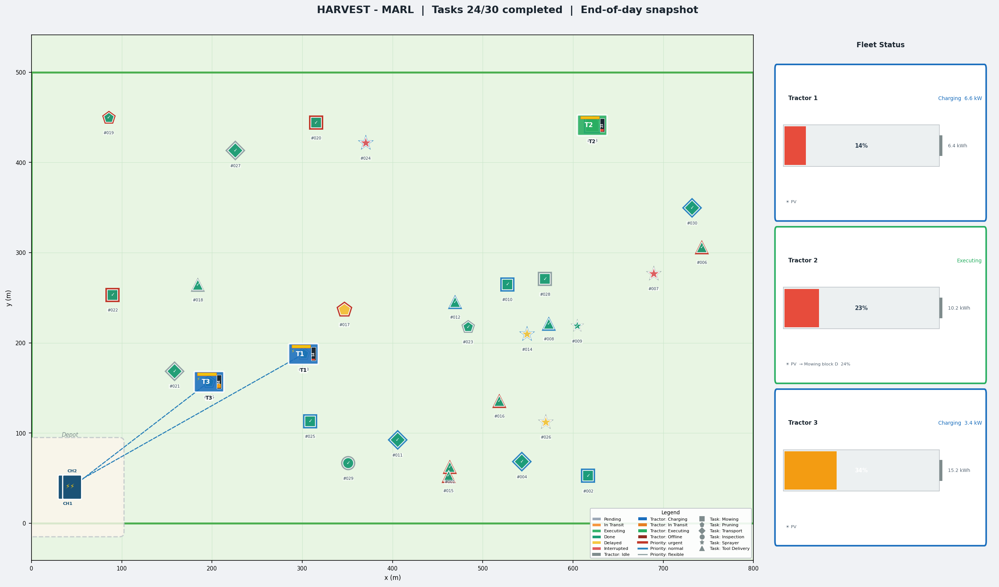](./images/marl_farm_map.png)

*Figure 3 — Farm map (`marl` scenario): task locations, types and outcomes, tractor positions and routes, depot chargers and fleet status.*

### Multi-agent (MARL) architecture

The `marl/` engine replaces central charging allocation with per-agent decisions: a
`TractorAgent` per tractor (idle / request charge), a `ChargingStationAgent` per
charger (off / half / full) and a `LoadAgent` per deferrable consumer (on / off).
Agents observe SOC, tasks, tariff, PV and net power, and receive per-step rewards
(cost, peak, task completion, battery stress). **All agents are currently rule-based.**
`act()`, `learn()` and the reward pipeline are wired so that a learned (e.g. PPO)
policy can be dropped in later; HARVEST does not yet ship trained agents.

The agent log makes every decision inspectable:

- the heatmap shows, per 15-minute step, what each tractor, charger and load agent
  chose;
- the SOC panel shows the batteries responding;
- the reward decomposition splits each step into cost, peak and task terms;
- the last panel checks grid draw against the cap.

[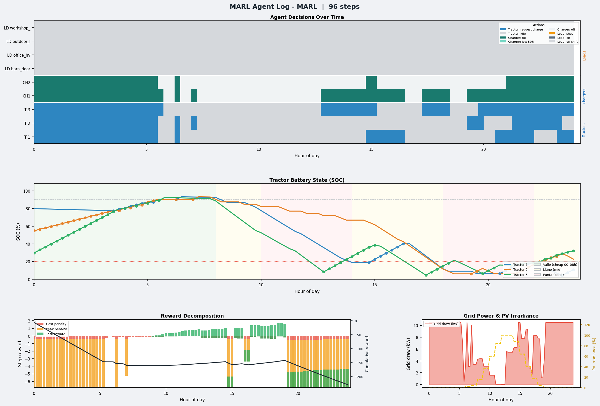](./images/marl_marl_dashboard.png)

*Figure 4 — MARL agent log: decisions over time, tractor SOC, reward decomposition and grid power.*

Compare the resulting power profile with Figure 2. Under per-agent control, more
charging shifts into the afternoon (grid draw of about 7–8 kW between 15:00 and
18:00), and the draw still stays within the 10.5 kW cap.

[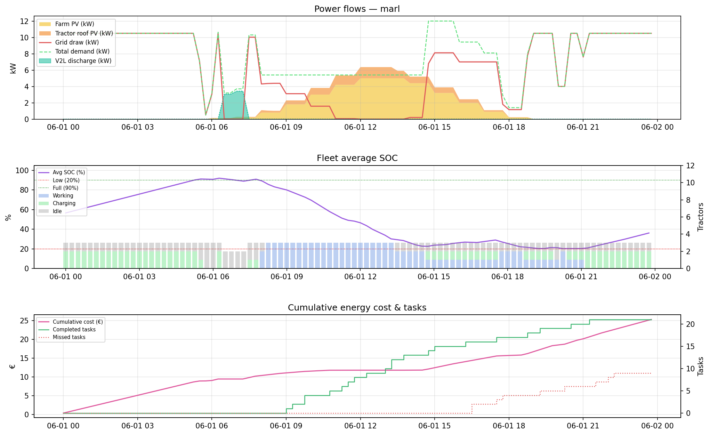](./images/marl_detail.png)

*Figure 5 — `marl` scenario day profile: power flows, fleet SOC and cumulative cost / tasks under per-agent control.*

Details: [docs/prediction-and-marl.md](docs/prediction-and-marl.md).

### Prediction module

`predictor/` forecasts **PV generation** and **farm load** behind one interface,
with four backends:

| Backend | What it is |
|---|---|
| `static` (default) | Hourly profile from `config.yaml` |
| `stub` | Offline seasonal bell curve (Jan ≈ 1 kW, Jun ≈ 5 kW peak) |
| `openmeteo` | Live Open-Meteo weather forecast (no API key, needs internet) |
| `nn` | Feed-forward neural network predicting PV shape and farm load |

The `nn` backend is trained on data from the **synthetic data generator**
(`predictor/synthetic.py`). The selected PV backend drives the simulator's PV profile.

`ForecastBundle` turns forecasts into **forward-looking charging headroom** and the
**best charging window** of a day. It is the interface intended for pro-active
scheduling and learned agents; the current rule-based scheduler does not consume it
yet.

The overview figure shows what the module produces:

- PV output varies about 5× between winter and summer (seasonal stub vs static
  profile);
- the stacked farm load comes from nine scheduled consumers;
- the backends are compared against noisy synthetic training samples;
- `ForecastBundle` charging headroom (`grid cap + PV − load`) is plotted with the best
  two-hour window highlighted against the tariff bands.

[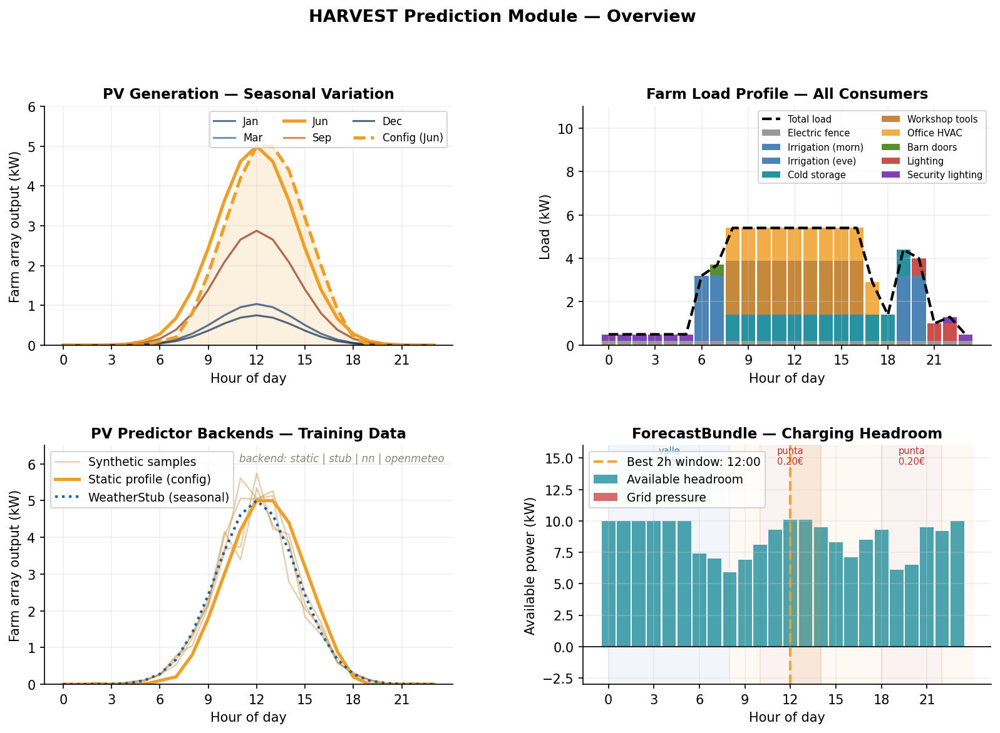](./images/prediction_overview.png)

*Figure 6 — Prediction module: seasonal PV, farm load, backend comparison and forecast charging headroom.*

Details: [docs/prediction-and-marl.md](docs/prediction-and-marl.md).

### Dynamic plan-change events

With `dynamic_events_enabled: true` (the committed default), the simulated day is
disrupted mid-run by six events that HARVEST must absorb without human input:

| Time | Event | Expected response |
|---|---|---|
| 06:30 | **Grid outage** | Tractors switch to V2L and power the critical farm loads |
| 07:30 | Grid restored | Normal charging resumes |
| 10:00 | **Urgent task injected** (emergency spraying) | Replanning; may preempt a tractor in transit |
| 13:30 | **Tractor breakdown** (tractor 2 offline) | Its work is redistributed to the rest of the fleet |
| 16:00 | **Grid-cap reduction** to 7 kW | Charging and deferrable loads squeezed under the new cap |
| 18:00 | Grid cap restored | Deferred loads and charging recover |

These events test resilience and autonomous replanning (the TPI2 evidence; the
standalone autonomous-control demo exercises the last four). On the farm map, the
plan-change log lists each event with its time. The broken-down tractor is marked
*Offline*, and the injected urgent task stands out with a purple halo.

[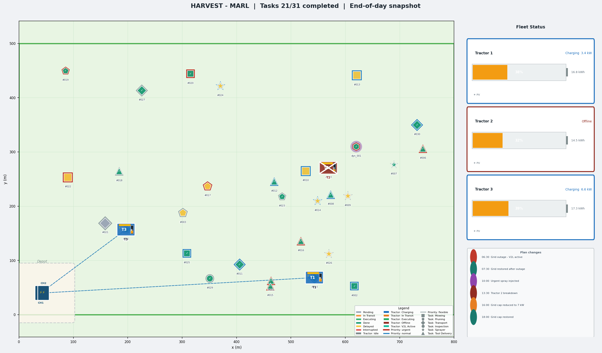](./images/marl_farm_map_dynamic_events.png)

*Figure 7 — Farm map with plan changes: outage and restore, urgent task injection, tractor-2 breakdown and grid-cap changes, handled autonomously.*

In the agent dashboard, dashed markers show exactly when each disruption hits. Notice
the V2L discharge during the outage, tractor 2's SOC freezing after the breakdown, and
grid draw held down while the cap is reduced to 7 kW (16:00–18:00).

[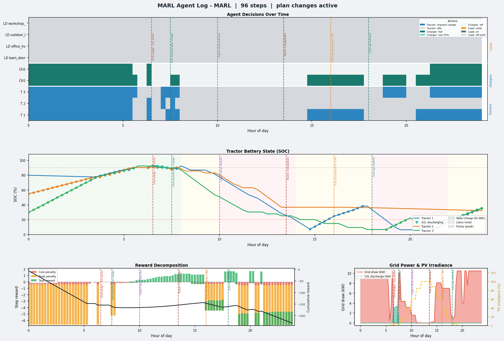](./images/marl_marl_dashboard_dynamic_events.png)

*Figure 8 — MARL agent log with plan changes: every panel annotated with the disruption times, showing how agents respond.*

### Fleet control interface

`harvest_control.FleetInterface` is the transport-independent boundary between
HARVEST's decisions and the plant. `snapshot()` returns the grid, tractor, charger and
load state; `submit(commands)` returns one acknowledgement per command. Commands cover
**charging requests** (request / release charge, charger level), **task assignment**
(assign / preempt), **load shedding** (shed / restore) and V2L start / stop. Backends
are the reference simulation and `DeviceFleetInterface` over Modbus / OPC-UA devices;
the live fleet is exposed as an HTTP API (`/api/fleet/*`) for FIWARE and ROS 2. The
decision layer cannot tell the backends apart. **The real ZETRABOT is not
directly controlled in the current deployment**; the device path runs against the
bundled farm-device simulator.

### DeviceIO — Modbus TCP / OPC-UA

`harvest_integrations/devices` reduces every protocol to one seam —
`DeviceIO.read()` / `write(point, value)` — with register addresses and node names in
configuration (`PointSpec`), not code; new protocols plug in with
`register_protocol(...)`. A bundled farm-device simulator serves **both protocols from
one farm state**: chargers, loads and grid meter as Modbus registers, the tractor BMS
as OPC-UA nodes.

The **cross-protocol demonstration** (Diagnostics tab, or
`POST /api/diagnostics/demo`) shows the abstraction end to end: a charge command
issued through `FleetInterface` is written to the tractor over **OPC-UA**, the
resulting charger power and grid-draw change are read back through the **Modbus** grid
meter, and the same state change appears as **NGSI-LD** entities in Orion-LD.

Each step in the recorded run carries the evidence observed on the other protocol.
Tractor 3's charge command was accepted over OPC-UA; the grid meter, read over Modbus,
moved from 3.60 to 10.20 kW; the broker then showed the tractor charging.

[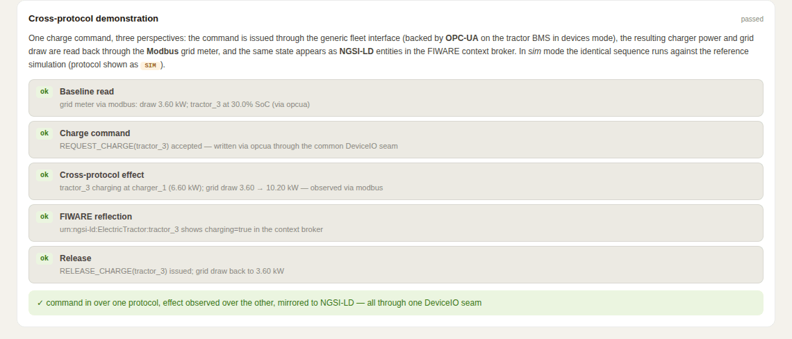](./images/diagnostics-cross-protocol-demo.png)

*Figure 9 — Cross-protocol demonstration (live Docker stack): one command over OPC-UA, effect observed over Modbus, state mirrored to NGSI-LD.*

### FIWARE / NGSI-LD

A sync daemon mirrors HARVEST's state into **Orion-LD** as SAREF-aligned NGSI-LD
entities: `ElectricTractor`, `ChargingStation`, `EnergyConsumer`, `FarmEnergySystem`
(grid, PV, tariff), `FarmTaskBoard` (task schedule), `FarmSimulation` (Isaac state)
and `TractorTelemetry` (real ZETRABOT data), with `observedAt` and `unitCode` on each
attribute. External systems can also **command the farm**: they PATCH the
`FarmCommand` entity, and the daemon forwards the commands to HARVEST (de-duplicated
by nonce) and writes the acknowledgements back.

### ROS 2

A containerised ROS 2 Jazzy bridge (`ros2_ws/src/harvest_ros`, no host ROS install)
publishes the live fleet on the `/harvest/*` topic family
(`/harvest/fleet/snapshot` and `/ack`, `/harvest/grid/draw_kw` · `pv_kw` ·
`price_eur_per_kwh` · `tariff`, `/harvest/tractors/<id>/soc_pct`) and accepts commands
on `/harvest/fleet/command`. Messages are versioned JSON sharing one schema with the
HTTP API and FIWARE (`harvest_integrations/codec.py`).

### NVIDIA Isaac Sim digital twin

HARVEST drives an optional physical layer: **real NVIDIA Isaac Sim 6.0.1** on the
host (`./run_harvest_dashboard.sh isaac`, viewable over **WebRTC**), or a **GPU-free
stand-in** (`isaac-demo`) that exercises the same loop anywhere. Tractors are PhysX
vehicles (chassis, four wheels, velocity-driven joints) that **physically drive** to
chargers and to task work zones drawn in the field, reporting measured poses and
progress back over ROS 2 (`harvest-sim/1.1` contract).

Task creation, assignment, progression and completion stay in HARVEST: the live task
service calls HARVEST's own scheduler, and **Isaac contains no second scheduler**. The
vehicle is a **functional ZETRABOT-style proxy**, not an exact CAD model; a real
ZETRABOT USD can replace it by editing `robot_models.yaml` only.
Details: [harvest_integrations/simulators/isaac/README.md](harvest_integrations/simulators/isaac/README.md).

### Real ZETRABOT telemetry

HARVEST ingests real ZETRABOT data through an inbound-only **`TelemetrySource`**
abstraction. Today's source is a Zetrack V2 mission export — asynchronous messages
from 14 message types, each signal at its own rate — **replayed** on its original
timestamps. A normaliser maps it onto a canonical per-tractor telemetry model (per-field
observation times, unknown signals preserved), and the real tractor joins the fleet
snapshot, Diagnostics and FIWARE (`TractorTelemetry`). A future **AWS** live source
implements the same interface (scaffold only today). Telemetry never travels on the
control path. Details: [docs/telemetry.md](docs/telemetry.md).

### KPI / model validation

Each mission is reduced to KPIs labelled **MEASURED**, **DERIVED**, **CONFIGURED**,
**ESTIMATED** or **MISSING**, and HARVEST's energy model is applied to the measured
operating profile. For mission 63 the tractor used **19.93 kWh** (measured V × I) where
the model predicts **27.37 kWh — about 37 % over-prediction**. The configured
**44.8 kWh** battery capacity is **broadly consistent** with the ≈ **43.3 kWh**
effective capacity the mission implies (an estimate, not a ZETRABOT specification), so
the mismatch lies mainly in the **operational-consumption assumptions**, above all
`pto_power_kw`. One mission is not enough for final calibration; suggested parameter
values are shown for review and never written to `config.yaml`. See
[Real telemetry validation](#real-telemetry-validation).

### ROI & investment analysis

`roi/` turns the latest Operations run into a **long-term economic analysis** over a
configurable horizon (typically 5–20 years). The operating year is simulated exactly
or with representative days per month, including seasonal PV.

| Investment | Compared against |
|---|---|
| Electric fleet + **charging infrastructure** | An equivalent **diesel** fleet doing the same work |
| **Fixed farm PV** / **tractor-roof PV** | Paired simulations differing only in that asset |
| **Backup / islanding** | Grid-tied system, expected-value outage model |
| **Combined portfolio** | Sequential stages, overlapping savings counted once |

Outputs are net CAPEX, annual net benefit, **NPV**, **IRR**, simple and discounted
**payback**, **ROI**, yearly cash flows and a one-way **sensitivity** analysis
(diesel price, electricity escalation, CAPEX, discount rate, outage assumptions).
Results are available in the dashboard, via `POST /api/roi` and from the CLI. **ROI
outputs are estimates based on user-supplied assumptions**: the shipped financial
values are demonstration figures, not supplier quotations.

In the investment table, every investment is evaluated per Operations scenario (net
CAPEX, annual benefit, payback, NPV, IRR, ROI), and "N/A" is shown honestly where an
investment never pays back. The combined portfolio below it counts overlapping savings
once.

[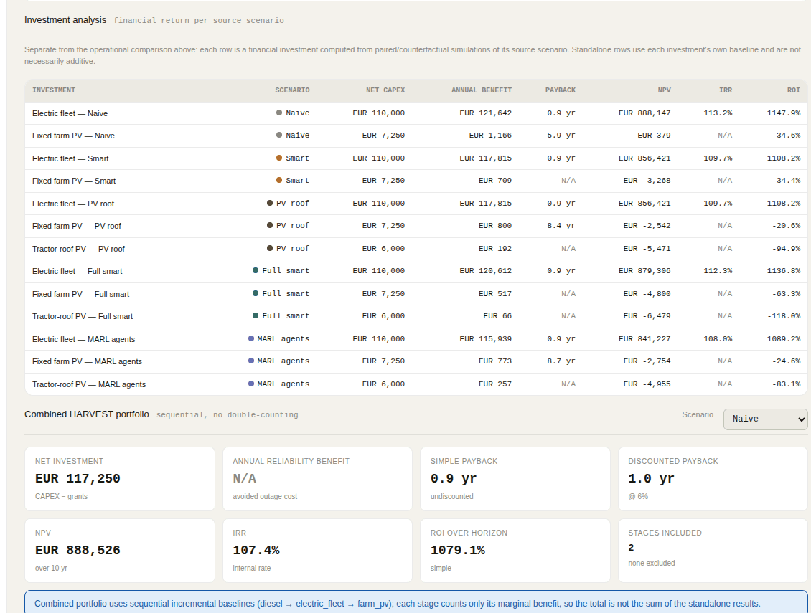](./images/roi-investments.png)

*Figure 10 — Investment analysis per source scenario and the combined HARVEST portfolio (shipped demonstration assumptions, not quotations).*

The cumulative and discounted cash-flow curves show when each investment crosses zero.
The tornado chart shows which assumptions move the portfolio NPV most under ±20 %;
here diesel price, tractor CAPEX and discount rate dominate.

[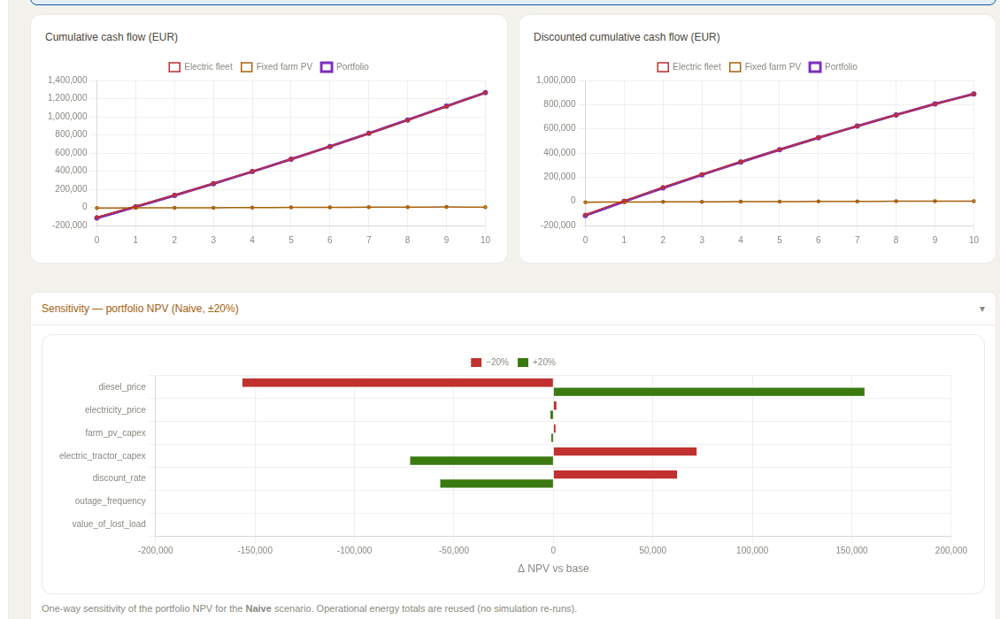](./images/roi-cashflow-sensitivity.png)

*Figure 11 — Cash flows over the 10-year horizon and one-way NPV sensitivity (±20 %).*

Details: [docs/roi.md](docs/roi.md).

## Dashboard

`http://localhost:8765` — one self-contained page (no internet needed) with three views.

**Operations** — configure grid cap, farm PV and roof-panel size, tractors, chargers,
charger power, battery capacity, task count and seed, pick the scenarios, and run the
real simulator. Results: KPI summary cards (lowest cost, best PV self-use, most tasks
done, lowest peak, best grid efficiency), a scenario comparison table, cost and
completion charts, and a per-scenario **task status** table (phase, progress, tractor,
delay reason) — see Figure 1 and Figure 15.

**ROI & Investment** — built strictly on the latest successful Operations run: fleet,
PV, tasks, seed and scenarios carry over read-only, and ROI is disabled or marked stale
when Operations changes. You set the period, horizon and financial assumptions; it
shows the long-term operational comparison, per-scenario investments, the combined
portfolio, reliability and sensitivity panels, and CSV / JSON export traceable to the
Operations run.

The operational-basis card at the top ties the analysis to one Operations run (run id,
fleet, PV, tasks, scenarios). Below it, the one-day scenarios are extended across a
whole year: 182 simulations with representative days per month and seasonal PV. The
charts compare annual cost, grid energy, tasks and PV use per scenario.

[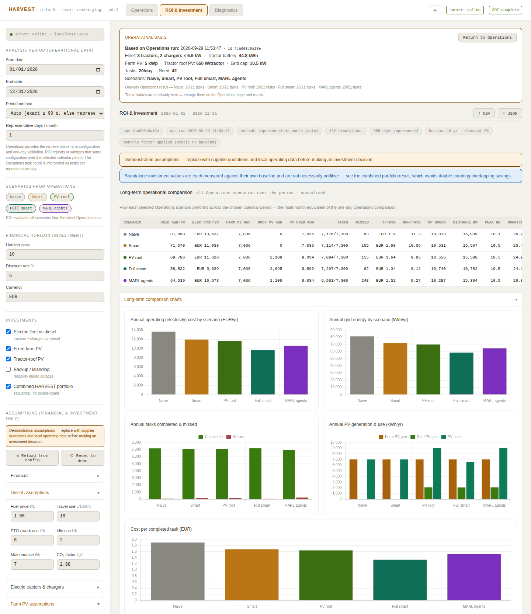](./images/roi-overview.png)

*Figure 12 — ROI & Investment view: operational basis, one-year long-term comparison and annual charts per scenario.*

**Diagnostics** — live view of the integration stack, refreshed every 3 s:

- **Service health** for the HARVEST API, fleet backend, Modbus and OPC-UA adapters,
  Orion-LD, MongoDB, FIWARE sync, ROS 2 bridge, Isaac Sim, farm tasks and real
  telemetry. Each is healthy, simulated, inactive, failed or unknown; an inactive
  service shows the command that starts it.
- **DeviceIO devices** with protocol, endpoint, reachability, latest values and age.
- **Real ZETRABOT mission KPIs & real-vs-model validation** (provenance badges,
  comparison table, rule-based findings, calibration proposals, limitations, JSON / CSV
  export), above the low-level real-telemetry signals.
- **Cross-protocol demo** (OPC-UA → Modbus → NGSI-LD) — Figure 9.

The screenshot below was taken with the `isaac-demo` stack running and the ZETRABOT
mission replaying. Ten services report *healthy*, and the Isaac layer honestly reports
*simulated* because the GPU-free stand-in is active. Several cards carry live facts, for
example the physical state of each simulated tractor, the task each tractor is
executing, and the replayed ZETRABOT's SOC, power and energy.

[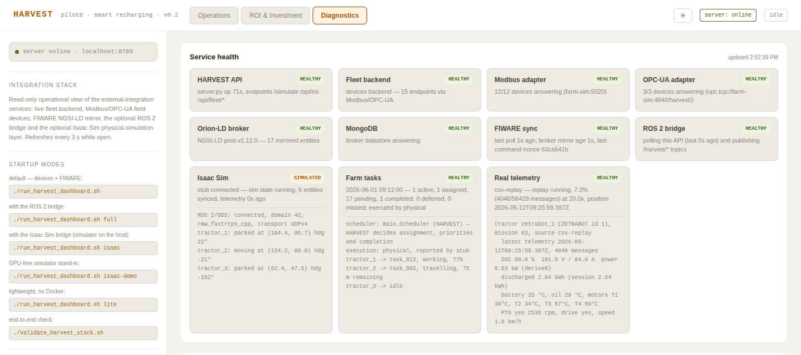](./images/diagnostics-service-health.png)

*Figure 13 — Diagnostics — service health of the full integration stack with live facts.*

The Devices table is read through the common DeviceIO abstraction, with one row per
field endpoint:

- the grid meter, chargers and farm loads are read over **Modbus**;
- the three tractor BMS endpoints are read over **OPC-UA**;
- the replayed ZETRABOT appears as a separate **csv-replay** telemetry row.

[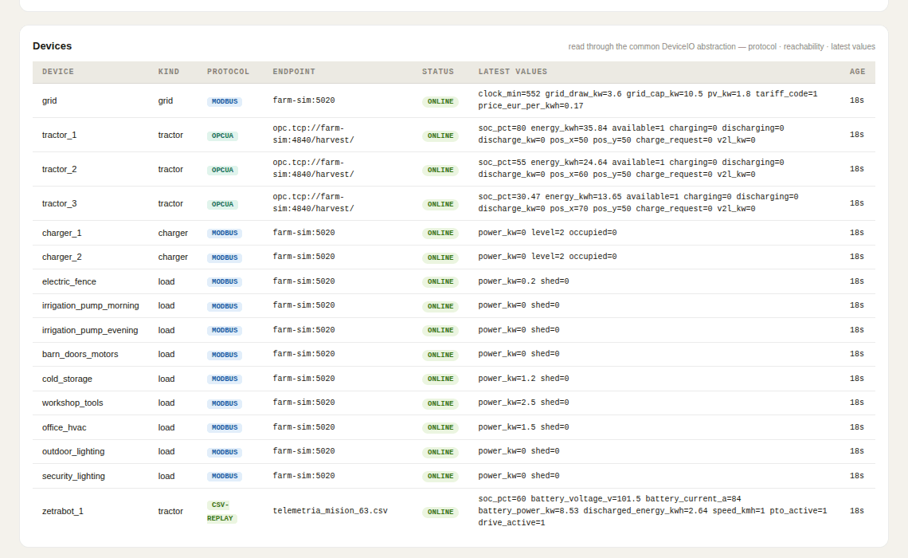](./images/diagnostics-devices.png)

*Figure 14 — Diagnostics — DeviceIO devices: protocol, endpoint, status, latest values and age.*

## Simulation capabilities

`main.py` simulates one farm day in 15-minute steps: 3 tractors (44.8 kWh, 4 of 8
battery modules swappable), 2 × 6.6 kW chargers, a 10.5 kW grid cap, farm PV, a
three-band tariff (valle / llano / punta) and nine farm consumers (fence, irrigation,
workshop, HVAC, lighting …) with priorities from *critical* to *low*.

| Scenario | Charging strategy | Roof PV | Load shedding | MARL |
|---|---|---|---|---|
| `naive` | Charge immediately at full power | ✗ | ✗ | ✗ |
| `night_only` | Only in the cheap valle window (00–08 h) | ✗ | ✗ | ✗ |
| `smart` | PV surplus + grid headroom | ✗ | ✗ | ✗ |
| `smart_with_swap` | Smart + battery-module swaps | ✗ | ✗ | ✗ |
| `pv_roof` | Smart + tractor-roof panels | ✓ | ✗ | ✗ |
| `pv_roof_swap` | Smart + swaps + roof panels | ✓ | ✗ | ✗ |
| `pv_roof_shed` | Smart + roof panels + shedding of non-critical loads | ✓ | ✓ | ✗ |
| `full_smart` | All optimisations | ✓ | ✓ | ✗ |
| `marl` | Per-agent decisions (rule-based agents) | ✓ | ✓ | ✓ |

**Task lifecycle**

```
PENDING → TRANSIT → EXECUTING → DONE
             │
             └→ INTERRUPTED  (preempted by an urgent task while in transit; re-queued)
PENDING → DELAYED            (window expired; deadline extended; re-queued)
```

TRANSIT is interruptible; EXECUTING (PTO work) is not. The task-status table in the
Operations view shows the lifecycle per scenario: here `full_smart` completed 27
tasks, with one *interrupted* task (preempted, then re-queued) and two *delayed* ones
whose window closed. Every row shows priority, phase, progress, tractor, time window
and the delay reason.

[](./images/task-status.png)

*Figure 15 — Task status by scenario: lifecycle phases, progress, assignment and delay reasons.*

**Operational KPIs** per scenario: total energy cost, peak grid draw, task
completion %, PV self-use share and PV utilisation, grid kWh per completed task,
tractor downtime % and cost per completed task — plus distances, operating / PTO /
charging hours and per-tractor breakdowns. Outputs go to `outputs/`: scenario summary
CSV, time series, task schedules and power / farm-map / MARL charts.

The scenario KPI comparison shows the trade-offs at a glance:

- `naive` has the highest cost and peak grid draw;
- `night_only` is cheap but completes the fewest tasks and leaves tractors idle;
- every coordinated strategy holds the peak at the cap;
- `full_smart` gives the lowest cost per completed task with top completion.

The chart comes from a 30-task run; the [Key results](#key-results) table quotes the
committed 21-task configuration.

[](./images/kpi_comparison.png)

*Figure 16 — Scenario KPI comparison across all nine strategies (30-task run).*

Details: [docs/simulation-model.md](docs/simulation-model.md).

## Real telemetry validation

The supplied **mission 63** covers one ZETRABOT tractor on three working days in May
2026: 56 428 asynchronous records, 4.5 h powered on, 3.70 km, 2.50 h of PTO work, SOC
64 → 18 %. It can be **replayed** into the running system (`replay --file …`), where it
becomes a live fleet member, or **analysed** offline or from the dashboard.

The Diagnostics tab turns this mission into a KPI panel. Each card shows its value,
its provenance badge (green MEASURED, blue DERIVED, grey CONFIGURED, amber ESTIMATED,
red MISSING), its formula and any quality flags. Examples:

- *Estimated remaining energy* is explicitly amber, because it depends on the
  configured capacity;
- *Discharged energy* notes the 14 rejected 0 V dropouts.

[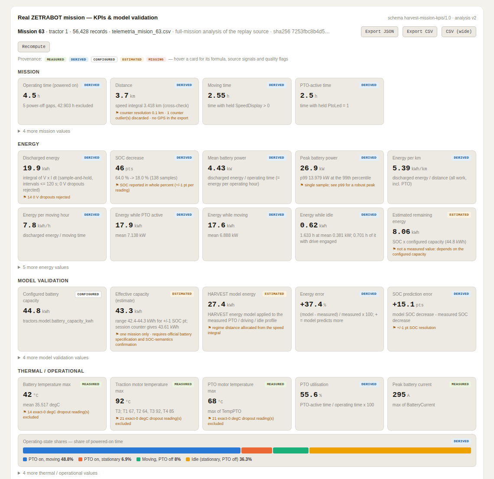](./images/diagnostics-mission-kpis.png)

*Figure 17 — Mission 63 KPIs with provenance, formulas and quality flags, and JSON / CSV export.*

**Provenance** keeps field measurements, derived figures and assumptions apart:

| Class | Examples |
|---|---|
| MEASURED | SOC, peak current (295 A), temperature maxima |
| DERIVED | V × I energy, ΔSOC, mean / peak power, energy per km / per hour, moving and PTO time |
| CONFIGURED | battery capacity from `config.yaml` |
| ESTIMATED | effective capacity; remaining energy (SOC × *configured* capacity); the `DischEnrgActualSesion` session-counter total, whose semantics are unconfirmed; HARVEST model predictions |
| MISSING | GPS position, charging state |

**Real vs HARVEST model** (difference = model − real):

| Metric | Real | Model | Error |
|---|---|---|---|
| Total energy | 19.93 kWh | 27.37 kWh | +37 % |
| SOC decrease | 46 pts | 61.1 pts | +15 pts |
| PTO-active consumption | 17.87 kWh | 26.38 kWh | +48 % |
| Idle (powered, stationary, PTO off) | 0.62 kWh | 0.49 kWh | −21 % |
| Battery capacity | ≈ 43.3 kWh (estimate) | 44.8 kWh (configured) | +3.4 % |

The same comparison appears live in the dashboard. It shows the real-vs-model table
with provenance on both sides, "unavailable" where the model cannot predict a metric
(peak power, charging), and the rule-based validation summary. The summary uses fixed
bands, with *ok / info / warning / limitation* levels, and no generated prose.

[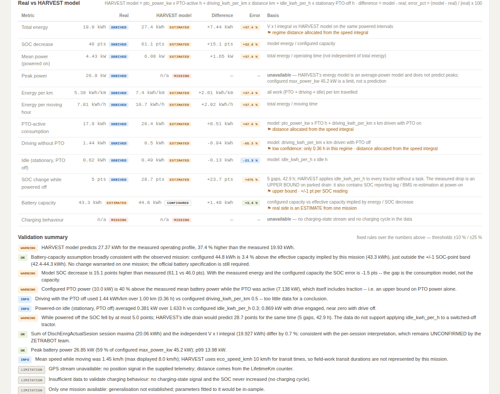](./images/diagnostics-real-vs-model.png)

*Figure 18 — Real vs HARVEST model comparison and rule-based validation summary for mission 63.*

**Main findings:** the measured energy with the configured capacity reproduces the SOC
drop within 1.5 points, so capacity is not the problem; the configured PTO power
(10 kW) is ≈ 40 % above the measured PTO-active battery power (7.1 kW, traction
included); while switched off (42.9 h) the SOC fell by at most 5 points where HARVEST's
idle drain predicts 28.7; peak power (26.9 kW) stayed at 59 % of the configured
maximum.

**Export.** KPIs export as JSON or CSV — `python -m harvest_integrations.telemetry.kpi …`,
or the dashboard's export buttons. Every value carries its formula, source signals,
provenance, the input file's SHA-256 and the analysis version.

**Future live data.** The CSV replay is one implementation of the `TelemetrySource`
abstraction that a live AWS source will use once its interface is known.

## Architecture

```
  ┌──────────────────────────────── HARVEST core ─────────────────────────────────┐
  │  Task scheduler · charging strategies · 15-min farm simulator     (main.py)    │
  │  MARL agents (marl/) · Prediction (predictor/) · ROI & investment (roi/)       │
  │  Live task service (reuses the scheduler) · Mission KPIs & model validation    │
  └───────────┬─────────────────────────────────────────────────────▲──────────────┘
              │ FleetInterface: snapshot() / submit(commands)       │ canonical telemetry
     ┌────────┴─────────┐                                   TelemetryNormalizer
  Simulation     DeviceFleetInterface                                │
  backend              │ DeviceIO                             TelemetrySource
  (reference)    Modbus TCP · OPC-UA                    CSV replay ✓ · AWS (scaffold)
                       │                                             │
            farm-device simulator                        ZETRABOT mission export
            (or real field devices)

  server.py — HTTP API + dashboard (Operations · ROI · Diagnostics)
     ├─ /api/fleet/* ◄──► fiware-sync ◄──► Orion-LD / MongoDB   (NGSI-LD entities,
     │                                                            inbound FarmCommand)
     └─ /api/fleet/*, /api/tasks ◄──► ROS 2 bridges (/harvest/*)
                                         └──► Isaac Sim 6.0.1 or GPU-free stub
                                              (physical execution, measured poses back)
```

- Prediction, MARL, ROI and KPI validation are HARVEST modules, not external
  integrations.
- The FIWARE, ROS 2 and Isaac layers consume the same HTTP fleet API and share one
  JSON schema.
- Telemetry is inbound only, and control goes out only through `FleetInterface`.

## Quick start

**Host Python** — the simulator and dashboard, without Docker:

```bash
python3 -m venv .venv && source .venv/bin/activate
pip install -r requirements.txt
python main.py        # simulate all scenarios -> outputs/ (CSVs + charts)
python server.py      # dashboard on http://localhost:8765
python -m roi --config config.yaml --start 2026-01-01 --end 2026-12-31 --horizon 10   # ROI CLI
```

**Docker stacks** — the integration layers (Docker + Compose only):

```bash
./run_harvest_dashboard.sh              # dashboard + Modbus/OPC-UA device simulator + FIWARE (default)
./run_harvest_dashboard.sh full         # + ROS 2 bridge
./run_harvest_dashboard.sh isaac        # + ROS 2 / Isaac bridges; starts real Isaac Sim on the host
./run_harvest_dashboard.sh isaac-demo   # the same loop with the GPU-free simulator stand-in
./run_harvest_dashboard.sh replay --file telemetry/telemetria_mision_63.csv --speed 20
                                        # replay the ZETRABOT mission (add --stack fiware for NGSI-LD)
./validate_harvest_stack.sh             # end-to-end check of what is running (exit code = failures)
./run_harvest_dashboard.sh stop         # tear everything down (also: status, logs [service])
```

**Local overrides.** Put personal settings in `config.local.yaml` (git-ignored,
deep-merged over `config.yaml` at every start), for example a predictor backend, task
count or seed. Start from `config.local.yaml.example`; delete the file to return to
the defaults.

Tests: `python -m unittest discover tests`. Protocol, ROS and real-mission tests skip
themselves when their prerequisites are absent.

## Key results

| Result | Evidence |
|---|---|
| **Grid-cap compliance** — every coordinated strategy (`smart` … `marl`) peaks at the 10.5 kW cap; `naive` reaches 14.4 kW and `night_only` 14.0 kW | `python main.py` (committed config) |
| **Cost at equal service** — `full_smart` vs `naive`: energy cost −28 % (€22.38 vs €31.18), grid kWh per completed task −26 %, same task completion (95.2 %). `night_only` is cheapest in absolute terms but completes only 71 % of tasks | `outputs/scenario_summary.csv` |
| **Autonomous control** — 100 % of decisions executed without manual intervention (target ≥ 70 %); all four plan-change events handled; peak 10.53 kW against a 10.5 kW cap | `python -m harvest_control.demo_autonomous_control [--events]` |
| **Forecasting** — farm-load MAPE 22.98 % (target ≤ 25 %), reported at Stage 2 | [docs/project-status.md](docs/project-status.md) |
| **Cross-protocol operation** — OPC-UA command → Modbus-observed charger / grid effect → NGSI-LD mirror | Diagnostics demo, `validate_harvest_stack.sh` |
| **Physical execution** — a tractor commanded by HARVEST physically drives to its charger and docks (real Isaac Sim 6.0.1 and the stub); task progress flows back to HARVEST | `isaac` / `isaac-demo` + validation |
| **Real field data** — ZETRABOT mission 63 replayed through the canonical telemetry model and mirrored to NGSI-LD | `replay` + validation |
| **Model validation** — HARVEST over-predicts mission energy by ≈ 37 % (19.93 vs 27.37 kWh); capacity assumption broadly consistent | [docs/telemetry.md](docs/telemetry.md) |

Current validation on this branch (2026-09-29): the unit suite passes (285 tests) and
`validate_harvest_stack.sh` passes 25 / 25 on the `isaac-demo` stack with the mission
replay running. The Stage-2 TPI table ([docs/project-status.md](docs/project-status.md))
reports ≈ 40 % peak and ≈ 42 % cost reduction for TPI1 from the Stage-2 study; the
numbers above are what the currently committed configuration reproduces.

## Limitations

- **Field validation:** there is currently **one** real ZETRABOT mission. The
  single-mission calibration candidates are proposals, not final model parameters.
- **Telemetry content:** the supplied CSV has **no GPS stream** and **no charging
  state or charging cycle**, so charging behaviour cannot yet be validated.
- **AWS:** the live AWS telemetry source is **not implemented** pending the ZETRABOT
  AWS interface details; only a scaffold exists behind `TelemetrySource`.
- **No direct control:** the real ZETRABOT is **not directly controlled** in this
  deployment; Modbus / OPC-UA control runs against the bundled device simulator.
- **Isaac Sim** uses a **functional proxy vehicle**, not an exact ZETRABOT model.
- **MARL** agents are **rule-based**. The learned-policy (PPO) hooks exist, but no
  trained policy is shipped.
- **Forecasting:** `ForecastBundle` headroom forecasts are available but not yet used
  by the rule-based scheduler.
- **Semantics:** capacity estimates and the `DischEnrgActualSesion` interpretation
  need confirmation from the ZETRABOT team and the official battery specification.
- **ROI** outputs depend entirely on the financial assumptions supplied; the shipped
  values are demonstration figures.

## Documentation

| Topic | Document |
|---|---|
| Installation, CLI, dashboard usage, configuration, dependencies | [docs/getting-started.md](docs/getting-started.md) |
| Launcher modes, fleet API, FleetInterface, DeviceIO, FIWARE, ROS 2, Isaac, Diagnostics | [docs/integrations.md](docs/integrations.md) |
| Real ZETRABOT telemetry: replay, signal dictionary, KPIs, provenance, validation, AWS | [docs/telemetry.md](docs/telemetry.md) · [AWS scaffold](harvest_integrations/aws/README.md) |
| Isaac Sim layer: contract, robot models, WebRTC, walkthrough | [harvest_integrations/simulators/isaac/README.md](harvest_integrations/simulators/isaac/README.md) |
| Simulation model: scenarios, consumers, task lifecycle, KPIs | [docs/simulation-model.md](docs/simulation-model.md) |
| Prediction module (backends, NN training, ForecastBundle), MARL engine, dynamic events | [docs/prediction-and-marl.md](docs/prediction-and-marl.md) |
| ROI & investment analysis: methods, formulas, dashboard, CLI | [docs/roi.md](docs/roi.md) |
| Project status (TPIs) and target architecture | [docs/project-status.md](docs/project-status.md) |
| Repository structure | [docs/repository-structure.md](docs/repository-structure.md) |

## Contact

**Simeon Tsvetanov** · set@hpc.bg
High Performance Creators Ltd · Sofia, Bulgaria · [hpc.bg](https://hpc.bg)
O-CEI Challenge P6C1 · Application ID: 691486e3b5fba953e852532f
