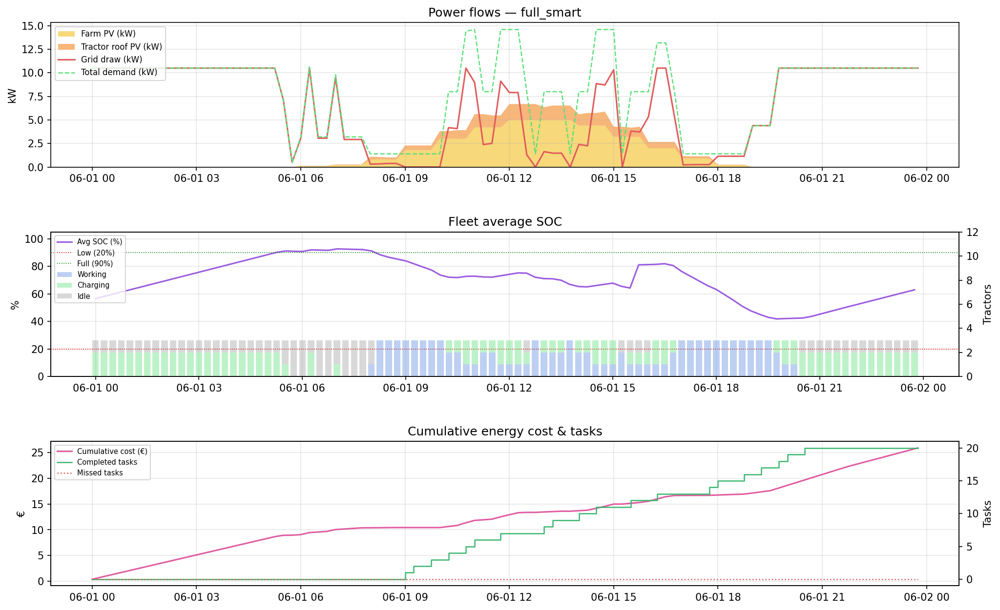
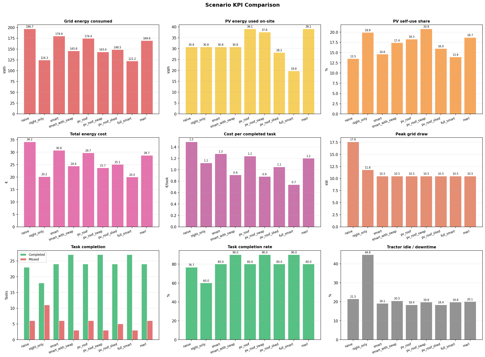
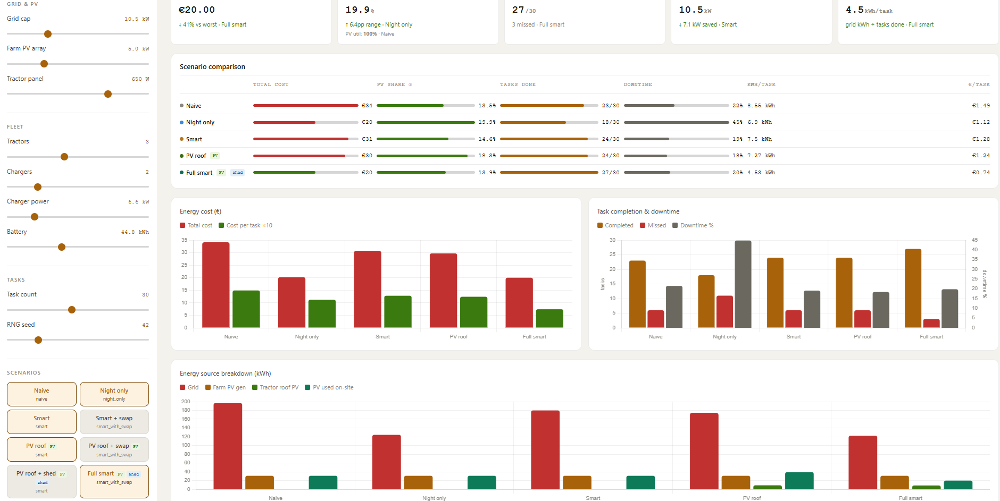
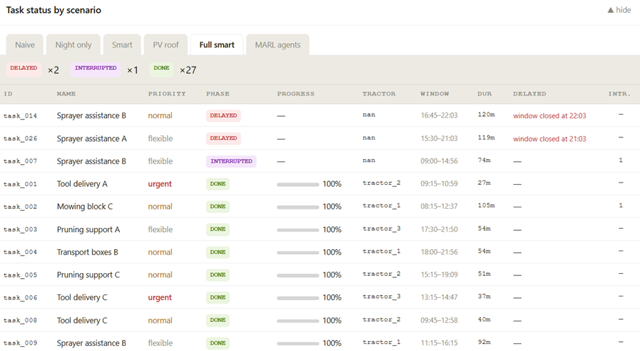

# Getting started

Installation, the host-Python entry points, the dashboard and the main configuration file. For the Docker stack see [integrations.md](integrations.md).

## Quick Start

Two ways to run HARVEST:

* **Docker (one command)** — the dashboard plus the whole external-integration
  stack (Modbus/OPC-UA device simulator, FIWARE NGSI-LD context broker,
  optional ROS 2 bridge), reproducible with no host-side setup beyond Docker:

  ```bash
  ./run_harvest_dashboard.sh          # dashboard + devices + FIWARE
  ./run_harvest_dashboard.sh lite     # host Python only — original behaviour
  ```

  See [integrations.md](integrations.md).

* **Host Python (lightweight)** — the original setup below; nothing about it
  changed, and none of the integration dependencies are required for it.

### Clone this repositoy
git clone https://github.com/hpcbg/harvest.git
cd harvest

### Create virtual environment and install dependencies
On Linux Shell:
```bash
python3 -m venv .venv
source .venv/bin/activate
pip install -r requirements.txt
```

On Windows PowerShell:
```bash
py -3.12 -m venv .venv
.\.venv\Scripts\Activate.ps1
pip install -r requirements.txt
```


### Option A — Command Line

```bash
python main.py
```

Results are saved to `./outputs/`:
- `scenario_summary.csv` — KPIs for all scenarios
- `timeseries_<scenario>.csv` — 15-min power/SOC timeseries
- `task_schedule_<scenario>.csv` — per-task lifecycle log
- `*.png` — KPI comparison charts and per-scenario power profiles

The power flow of the `full_smart` scenario:

[](../images/full_smart_detail.png)

Scenario KPI comparison:

[](../images/kpi_comparison.png)

### Option B — Web Dashboard (recommended for demos)

```bash
python server.py
```

Then open **http://localhost:8765** in Firefox, Chrome, or Edge.
The browser opens automatically. The dashboard is fully self-contained — Chart.js is bundled inline, no internet connection required.
Use the header tabs to switch between the **Operations** view and the **ROI & Investment** view.

[](../images/dashboard-overview.png)

### Option C — ROI & Investment analysis (CLI)

```bash
python -m roi --config config.yaml --start 2026-01-01 --end 2026-12-31 --period-mode auto --horizon 10
```

Writes `outputs/roi/roi_summary.csv`, `roi_cashflows.csv`, `roi_assumptions.json` and
`roi_report.json`. See [roi.md](roi.md) for the full model.

## Dashboard Usage

1. **Left panel** — adjust parameters with sliders:
   - *Grid & PV*: grid cap (kW), farm PV array size, tractor roof panel wattage
   - *Fleet*: number of tractors, chargers, charger power, battery capacity
   - *Tasks*: task count (5–60), RNG seed

2. **Scenarios** — click pills to include/exclude. Tags show active features:
   - `PV` — tractor roof panels enabled
   - `shed` — non-critical loads suppressed during grid stress

3. **RUN SIMULATION** — calls `server.py`, which runs the real Python simulator and returns results within seconds.

4. **Results panel**:
   - 5 KPI summary cards (lowest cost, best PV self-use, tasks completed, peak grid, grid efficiency)
   - Scenario comparison table with inline progress bars
   - Energy cost and task completion charts
   - **Task status table** — collapsible per-scenario view with phase badges, progress %, tractor assignment, delay reason

[](../images/task-status.png)

5. **View tabs** (header): **Operations** (above), **ROI & Investment**
   (long-term economics) and **Diagnostics** — the operational/debug/demo view
   of the external-integration stack, described under
   [Diagnostics view](integrations.md#diagnostics-view).

## Configuration

All parameters are in `config.yaml`. Key sections:

```yaml
simulation:
  start_time: "2026-06-01 00:00:00"
  end_time:   "2026-06-02 00:00:00"
  time_step_minutes: 15

grid:
  max_power_kw: 10.5

pv:
  farm_fixed_peak_kw: 5.0    # building/ground array peak capacity

tractor_pv:
  panel_peak_w: 650          # per-tractor roof panel

task_generation:
  mode: "generated"          # static | generated
  num_tasks: 20              # scale with fleet: ~6-7 tasks per tractor per day
  seed: 42
  work_speed_kmh: 4.0        # in-field working speed → derives task work-distance for ROI

prediction:
  pv:
    backend: static          # static | stub | openmeteo | nn

roi:                         # long-term ROI & investment economics — see
  enabled: true              # docs/roi.md
  # analysis / financial / diesel / electric_fleet / farm_pv / tractor_roof_pv /
  # outages / sensitivity …  (all economic values default to zero = "Input required")
```

## Dependencies

```
Python >= 3.10
numpy, scipy, pyyaml, pandas, matplotlib   # core (always required)
tensorflow                                  # only for nn predictor backend
pymodbus (pinned 3.6.9), asyncua            # only for the Modbus/OPC-UA device
                                            # backend & farm simulator
```

```bash
pip install -r requirements.txt
pip install -r requirements-integrations.txt   # optional — device backend only
pip install -r requirements-aws.txt            # optional — AWS telemetry adapters; every
                                               # line is commented out until the service is known
```

The real-telemetry layer (`harvest_integrations/telemetry`) and the AWS
scaffold are standard-library only.

The Docker stack (`./run_harvest_dashboard.sh`) needs only Docker + Compose on
the host; all Python, FIWARE and ROS 2 dependencies stay inside the
containers.  No cloud services or API keys required (except the optional
`openmeteo` backend for live weather forecasts).

